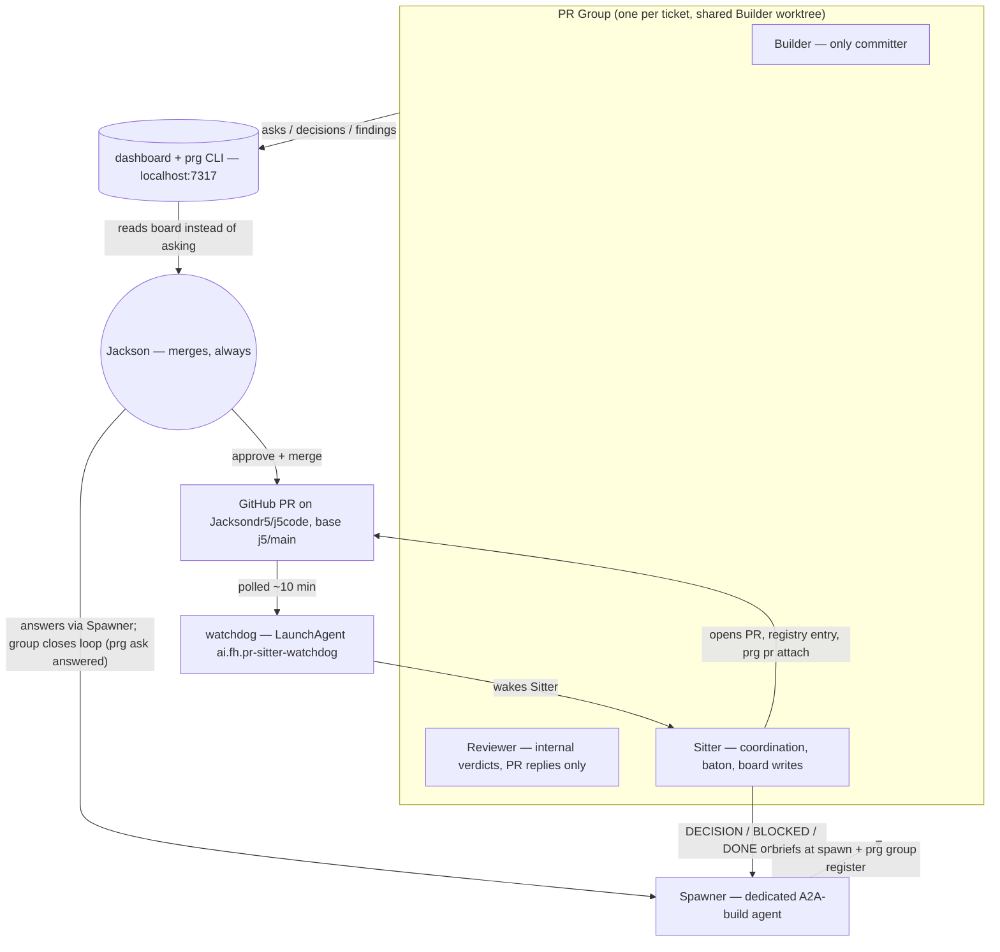

# PR Groups on j5code

PR Groups are Jackson's build-management practice for agent-run PRs: **Builder + Reviewer + Sitter** spawned together per PR, with a standing **Spawner** outside the group. The methodology lives in the playbooks repo; status is **measured, not recalled**, on a local dashboard. This artifact records how the system is installed on this machine (as of 2026-08-16) and the j5code-specific rules every group must follow.

**Source of truth for the methodology is `~/.pr-group/` — every group agent reads `00-roles.md` at bring-up.** This artifact does not duplicate the playbooks; it covers the install and the j5code deltas.

<user_quoted_section>SHAKEDOWN FIRST (Jackson, 2026-08-16): exactly one PR group runs to start, and its retro gates any further staffing. Details in Shakedown gate below.</user_quoted_section>

## The system, in one diagram

## Installation on this machine (done 2026-08-16)

| Piece              | Where                                                                                                       | State                                                                                                |
| ------------------ | ----------------------------------------------------------------------------------------------------------- | ---------------------------------------------------------------------------------------------------- |
| Playbooks          | `~/repos/jacksondr5/pr-group`, symlinked at `~/.pr-group`                                                   | cloned from `Jacksondr5/pr-group`                                                                    |
| Dashboard + `prg`  | `~/repos/jacksondr5/pr-group-dashboard`, symlinked at `~/.pr-group-dashboard`                               | cloned from `Jacksondr5/pr-group-dashboard`                                                          |
| Board service      | `~/Library/LaunchAgents/ai.fh.pr-group-dashboard.plist`, `http://localhost:7317`                            | running (self-polls: agents 20s, GitHub 60s)                                                         |
| `prg` on PATH      | `/opt/homebrew/bin/prg` (wrapper → `~/.pr-group-dashboard/bin/prg`)                                         | verified: `prg gates` measures live                                                                  |
| Watchdog           | `~/.traycer/pr-sitter/watchdog.sh` + `ai.fh.pr-sitter-watchdog` LaunchAgent                                 | pre-existing, running; reads `epic_id` per registry entry, so j5code entries need no watchdog change |
| Dashboard identity | Traycer agent `60be3b6a-7997-4446-8984-12d762a7d2d9` — "PR Group Dashboard (identity pin — do not archive)" | pinned in `.env` and the plist; archiving it makes liveness polling go quiet (fails safe)            |

`.env` (not committed): `TRAYCER_EPIC_ID=5690b096…` (this epic, as connection anchor — the board spans all epics), `TRAYCER_AGENT_ID=60be3b6a…`, `PRG_AGENT_LOGIN=Jacksondr5`, `PRG_DEFAULT_REPO=Jacksondr5/j5code`. Bitbucket is unused here.

Service management: `launchctl kickstart -k gui/$UID/ai.fh.pr-group-dashboard` to restart / pick up code changes; logs in `~/.pr-group-dashboard/dashboard.log`.

## Operating rules for j5code builder agents

The nine hard rules of `00-roles.md` apply unchanged. j5code specifics:

1. **Base branch is `j5/main`.** Work branches are named `j5/<slug>` (matching existing history: `j5/ci-packaging`, `j5/fleet-load-test`). Never target upstream (`pingdotgg/t3code`) with anything.
2. **FORK.md is governing law and goes in every brief** — Builder, Reviewer, and Sitter alike (the Reviewer blocks on it, the Sitter checks it). Add, don't modify: J5 code in new files/packages; only small appended integration cases in upstream-owned files; `apps/server` core, `packages/contracts`, `packages/client-runtime`, existing adapters, and `.repos` are off-limits. A change that can't fit this discipline stops and goes up as a DECISION before implementation.
3. **PR titles are conventional commits** (`feat: …`, `fix(web): …`), one concern per PR. If the description says "also", split it.
4. **CI gate = the J5 workflows** (`.github/workflows/j5-*.yml`). Gate 2 of `prg gates` measures the rollup at head; a red upstream-inherited workflow is diagnosed by the Sitter before routing, never forwarded raw.
5. **One group per ticket.** The group is spawned before the PR exists, all three seats bound to the Builder's worktree, and registered at spawn (`prg group register`). No backport flow exists on j5code (no `release/**` branches) — `06-backport.md` is dormant here.
6. **CodeRabbit is active on j5code.** Gate 6 requires an evidence-backed disposition of every CodeRabbit thread on the exact PR head, using the `04-rounds.md` triage flow. The independent Reviewer's verdict and the readiness correction for GitHub approval remain required; neither substitutes for bot triage.
7. **Attribution line on every GitHub post** (hard rule 7): posts go out under `Jacksondr5`, opening byte-identical with `Posted by an AI agent on Jackson's behalf`.
8. **Jackson merges. Always.** READY goes up only after `prg gates` shows 1–6 green and the judgment gates (negative control included) are asserted with evidence. **Readiness correction (Jackson, 2026-08-16, during the A1 shakedown): a separate human GitHub _approval_ is NOT required for these builds — disposed CodeRabbit comments + green applicable checks are sufficient external-review evidence (a known gate-1 mismatch to read accordingly). The group's independent Reviewer verdict and judgment-gate evidence are still required. Jackson still performs every merge.**
9. **Upstream-pin discipline:** groups never advance the pin in `FORK.md` as a side effect. Rebases onto a new upstream base are their own deliberate, reviewed change — out of scope for any feature group.

### Required board writes (the group owes these)

- Spawner at spawn: `prg group register --sitter <id> --builder <id> --reviewer <id> [--spawner <id>]`
- Sitter at PR open: registry JSON at `~/.traycer/pr-sitter/registry/j5code-<pr>.json` + `prg pr attach --as <sitter> --pr <n> --repo Jacksondr5/j5code`
- Anything needing Jackson: `prg ask` (urgency honest — `blocking` means blocking)
- At retire: close every open ask/finding, then `prg group done --as <sitter>` — Jackson cannot clear rows himself.

## Roles for the A2A build

- **Spawner = a dedicated A2A-build agent** (Jackson's call, 2026-08-16): the Director stays strategic; a standing Spawner agent runs the PR Groups for the A2A tickets and reports to the Director. It must be briefed on `~/.pr-group/00-roles.md`, `01-spawn.md`, and this artifact, and it registers every group it spawns.
- **Granularity: one group per ticket.**

### Shakedown gate — exactly one group first

Jackson's ruling, 2026-08-16, after setup completed: **staff exactly ONE PR Group to start.** The practice is unproven on j5code, and this run exists to find where it breaks — watchdog wakes, board writes, FORK.md friction, J5 CI interpretation.

- The Spawner picks the most self-contained ticket and runs it through the **full** lifecycle: spawn → pre-PR review → PR open → rounds → READY → Jackson merges → retire. Director's pick: **A1 (ledger + epic entity)** — dependency-free, all new-file work, off the critical path.
- **Nothing else is staffed until that group retires and its retro items reach the Director.** The retro is the gate on scaling to the remaining A2A tickets.
- Only after that gate clears does the per-ticket granularity above fan out to the rest of the build.
