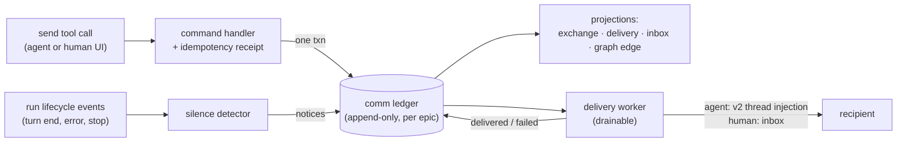

# A2A v1 plan

Drafted 2026-08-16 from the settled decision register (`../` — D1–D10, all closed). This document tells a builder *what to build and why it has this shape*; the register holds the decisions and rationale; the grounding section there explains the four-layer model. Read both before starting. Product definition: `../../communication-graph/`.

## Base (confirmed by the Director, 2026-08-16)

1. **Build against `j5/main` @ `e7597dac8`** (github.com/Jacksondr5/j5code; local clone `/Users/jackson/repos/jacksondr5/j5code`) — upstream v2-branch tip `993407dd9` + four J5 new-file commits. Builds green (pnpm 11.10.0 / fnm Node 24 / Rust 1.95 repo-pinned), 8,598-test zero-failure baseline, rebranded (`codes.jackson.j5code`, state `~/.j5code`), zero cloud dependencies.
2. **v2 contracts are present and functional**: `orchestrationV2.ts`, `orchestratorMcp.ts`, `ThreadManagementService`, v2 event tables (migrations 041–049) — load-harness-proven end to end (30 concurrent threads through production v2 dispatch; real Codex + Claude Agent turns). Director's ruling: additive A2A build may start now; **one rebase when upstream PR #2829 merges to main is certain — treat it as planned work**, and add-don't-modify is the survival discipline (upstream has already force-rewritten this branch's history once; `FORK.md`'s pin log is authoritative, never assume linear history).
3. **J5 surface conventions**: A2A code follows the established pattern — `apps/server/src/j5/a2a/` (or a new package), `scripts/j5/`, `.github/workflows/j5-*.yml`. Toolchain is pnpm + Vite Plus (`vp`) — never bun. Providers available day one: `codex` + `claudeAgent` only. Reusable perf rig for A2A load checks: `scripts/j5/fleet-load.sh` + `apps/server/src/j5/fleet-load.ts` (file-backed v2 dispatch, no-network stub provider).
4. **Add-don't-modify discipline**: A2A ships as new contract files, new event tables with their own migrations, new services. Never edit v2 contracts or tables — new files cherry-pick cleanly across upstream rebases.
5. House architecture patterns apply (engineering constitution): command → durable idempotency receipt → pure decider → events + projections in one SQL transaction → ordered publish; drainable workers with milestone receipts (tests await milestones, never sleep); snapshot + resumable delta streams.

## What v1 is NOT (scope fences)

No graph UI or attention panes (item 4). No roles/teams objects (item 3 — placement ≠ team membership). No cross-machine delivery (deferred; nothing may *assume* single-host, but nothing implements multi-host). No deferred silence states (`waiting-on-external-gate`, `silent-tool-degradation`, PTY-quiet). No message kind tags (cut). No agent-initiated re-parenting (human-only, UI). No epic *container* features beyond the minimal entity below — terminals, artifacts, folders, worktree binding all stay out (future backlog items).

## Architecture

One new event-sourced aggregate per epic — the **communication ledger** — with projections, a delivery worker, and a silence detector. All A2A state derives from the ledger; projections are disposable (measured-tables property).

### Epic entity (M1) — added in Director review

T3 has **no epic object** (nearest native concepts: project/environment), and this whole design is per-epic — so M1 ships a **minimal epic entity**: `epic` (id, name, created_at) plus a membership projection derived from the ledger's own `participant.joined/left` events. Nothing more. Scoping ledgers to T3 projects instead was rejected: it would silently redefine the product's container concept, and item-4 dashboards need real epic ids. The full epic container (terminals, artifacts, folders) is deliberately future work; this entity is just enough for the ledger and dashboards to have an address.

### Ledger (M1)

`comm_event` table, per-epic monotonic sequence, append-only: `seq`, `epic_id`, `kind`, `sender`, `receiver`, `exchange_id?`, `correlation_id?` (cross-epic), `payload`, `created_at`. Event kinds: `exchange.opened`, `message.sent`, `message.delivered`, `message.delivery_failed`, `exchange.closed` (the reply), `silence.notice`, `participant.joined/left`. Rows are never edited; corrections are new rows.

Participants: anything with its own thread — main agents, child agents (agent-created real threads), and **one global human node** (not per-epic; cross-epic exchanges reach the same user). Provider-native `ExecutionNode` subagents are not participants and never appear (D1).

### Exchanges (M2)

Our reply-obligation object (D9 — never called "thread"; a T3 thread is a conversation, an exchange travels through them). Semantics stolen from Traycer verbatim: reply-expected send mints `exchangeId`; **idempotent open per sender→receiver pair** (asking twice joins the existing exchange); follow-ups join; ONE reply carrying the id closes everything; taught as envelope prompt text. Required at open: a one-line **intent summary** (tool schema enforces; wording iterable). Opens addressed to the human also carry `urgency: blocking|soon|fyi`.

### Message pipeline — log-first (M2)

The ledger row is the primary act; delivery is an attempt recorded against it:

1. Send command validates participants, appends `message.sent` (+ `exchange.opened` if applicable) in one transaction. The tool returns once the row is durable.
2. The delivery worker drains undelivered rows: agent recipients get injection via v2's thread-send; the human gets an inbox row. **Exactly-once injection comes from upstream's own dedup, not from our receipt**: the worker derives v2's `clientRequestId` deterministically from the ledger message id, so a post-crash re-drain replays as the same command and v2 dedupes it. Our `message.delivered` receipt records the outcome but cannot be the guarantee — it does not survive the crash window between successful injection and recording. Success appends `message.delivered`; failure appends `message.delivery_failed` and retries with backoff.
3. Rows failing past the retry threshold surface as an alarm state in projections — an undelivered message is a **visible gap, never a silent loss**. This applies equally to one-shots (no exchange, but same delivery guarantees) — "was it delivered" and "was it answered" are independent guarantees.
4. Startup reconciliation: on host restart, the worker re-drains anything sent-but-not-delivered. No RAM-only state anywhere.

Cross-epic (D8): sender's epic gets the row first; the delivery worker writes the paired row into the receiver's epic ledger as part of delivery — deliberately an **async two-step, never one transaction** (collapsing it would smuggle in a single-host assumption). Hardening (Director review): the receiver-side paired row is a **distinct kind, `message.received`** (same payload, carrying `correlation_id` + origin epic — never a mirrored `message.sent`, which would misattribute the act); a **unique constraint on (receiver `epic_id`, `correlation_id`)** makes the paired write idempotent under worker retry. A half-completed cross-epic send is visible in the sender's ledger, not lost between them.

### Envelopes (M2)

One formatter, per-channel renderings (wording can never drift between surfaces — Traycer's pattern). Channels: peer-message into an agent; **human-origin inbox message into an agent** (must state plainly: the human is not watching this chat and sees only what returns on this exchange); silence notice (clearly marked system signal, never looks like a peer message). All wording lives in **versioned config Jackson owns** — agents supply mechanics, the human supplies voice. Envelopes teach the exchange semantics at the moment of action (validated placement).

### Silence detection (M3)

Subscribes to run-lifecycle events; notices are appended to the ledger and delivered to the waiter through the same pipeline. v1 states (D6):

| State | Derivation |
| --- | --- |
| `turn-ended-no-reply` | Recipient's turn ended; open exchange delivered before turn end; no closing reply. Sub-split via timestamps: *processed* (delivered before turn start) vs *never-processed* (no turn since delivery) |
| `errored` | Turn ended on error; raw detail attached |
| `stopped/cancelled` | Lifecycle stop/cancel; notice carries **do-not-retry, do-not-replace** instruction text |
| `awaiting-human` | Recipient has an open exchange addressed to the human. *Human-knows* = inbox row delivered; *human-doesn't-know* = inbox delivery failed (alarm state) |
| `blocked-on-peer` | Recipient has its own open outbound exchange; the notice payload stores the named peer's id **structurally** (not just prose), so item 4 can later detect blocked-on-peer *cycles* (A↔B mutual deadlock — detection deferred, not v1) without a ledger migration |

Notices inform the waiter; they never auto-close exchanges. No PTY/quiet watchdog tier — we have real events.

### Human node (M4)

The inbox is necessarily a **cross-ledger projection**: one global human node + per-epic ledgers means it aggregates open human-addressed exchanges across *every* epic ledger on the host — a builder must not scope it per-epic and call it done. Inbox projection = open exchanges addressed to the human, ranked by urgency then age. The human's answer (typed in the app) **is** the closing reply event: captured verbatim, durable, linkable by id — and delivered to the asker through the normal pipeline. Loop closure is therefore *structural*: no manual "ask answered" step, no relay, no qualifier-shedding. Human→agent sends through the graph use the human-origin envelope; human silence emits no notices (unanswered-count and age are dashboard metrics, item 4).

### Graph projection + read API (M5)

Edge = exchange (never message), state open/stalled(reason,trust)/answered/dropped, plus delegation edges from v2 delegations (D1). Read API: per-epic cursor subscription — strictly ascending, exactly-once, gap-free relative to the cursor, with the documented caveat that *snapshot end is a batching fact, not caught-up-to-now* — plus a full-state reconciliation query (events + snapshot, never events alone). Cross-epic edges render in each epic as external stubs joined by `correlation_id`. Rebuilding any projection from the ledger must be byte-equivalent — this is a test, not an aspiration.

### Agent tool surface

Minimal, one send verb (Traycer's shape): `send_message(to, message, expect_reply?, exchange_id?, intent?, urgency?)` — reply = send carrying `exchange_id`. Plus `list_participants` with per-row capability booleans (tell callers what they may do, never let them discover by failing). Errors must name the actual state and the next command (toolsmith rule). Placement (D10): agent/thread creation tools gain a `placement` parameter (default = spawner; sibling/other-parent/root allowed); provenance recorded separately and immutably; cascade operations follow placement.

## Milestones (each independently verifiable; formal ticket breakdown is a separate pass)

| M | Deliverable | Verification |
| --- | --- | --- |
| M1 | Ledger + minimal epic entity: tables, contracts, append/read, cursor contract, membership projection | Ordering/gap-free property tests; restart persistence; idempotent append via receipts; membership projection rebuilds from ledger |
| M2 | Send/deliver/reply loop: pipeline, envelopes, exchange lifecycle, retries, startup reconciliation, cross-epic double-entry | Kill host mid-delivery → delivered exactly once after restart, **specifically covering the injected-but-unrecorded crash window** (v2 `clientRequestId` dedup proven, not assumed); cross-epic: crash between sender-row commit and receiver-row write → after restart exactly one paired row, sender ledger shows correct delivery state; forced delivery failure → visible alarm, never silent; exchange idempotent-open and one-reply-closes proven by test |
| M3 | Silence detector: five states | Scripted scenario per state (e.g. recipient turn ends silent → waiter gets authoritative notice; cancel → notice carries do-not-retry text); zero notices for healthy idle agents |
| M4 | Human node: inbox model, urgency, verbatim answers | End-to-end: agent asks → inbox row → human answers → exchange closes → asker receives the exact text; unanswered inbox items never expire silently |
| M5 | Graph projection + read API | Projection rebuilt from ledger is byte-equal; cursor subscription exactly-once under reconnect; playback renders a past state correctly |

Negative controls are required at every milestone (gate-8 discipline): every verification must be shown *capable of failing* — feed the delivery test a poisoned injection, the gap-free test a deleted row, before trusting a pass.

## Build-time open items (not design blockers)

Verify upstream UI affordances for interacting with delegated child threads (D1 note). **Before M2: confirm the internal `ThreadManagementService` path (not just the MCP tool surface) honors `clientRequestId` dedup at pin `e7597dac8`** — the exactly-once story depends on it. Retry/backoff parameters and the undelivered-alarm threshold (pick sensible defaults, make them config). Envelope config file format. The planned #2829 rebase (base §2) — schedule it as explicit work when upstream merges, not as a surprise.
