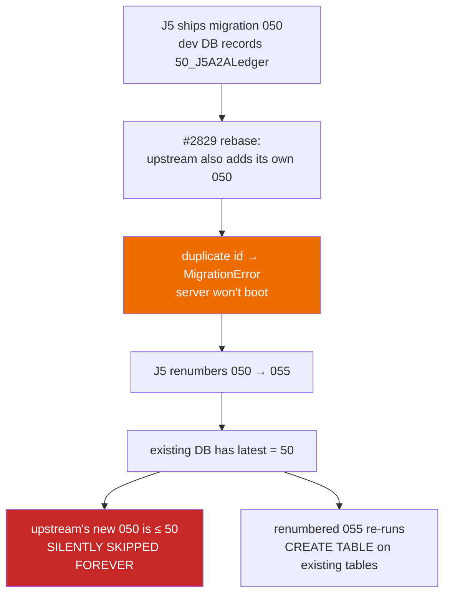

# J5 migrations run in their own lane

**Settled 2026-08-16**, pre-build, during A1. Raised by the Reviewer, decided by the Builder. Recorded because the code cannot explain itself: a future reader who finds a `j5_migrations` tracking table will reasonably ask why A2A's tables aren't just migration `050` in `apps/server/src/persistence/Migrations.ts` like everything else. This is that answer.

Relevant beyond A1: **A7 (upstream rebase) inherits the consequence**, and A2–A6 all add tables under the pattern set here.

## The decision

|                            |                                                                                                                                                |
| -------------------------- | ---------------------------------------------------------------------------------------------------------------------------------------------- |
| **Chosen**                 | A J5-owned migrator with its own tracking table and its own id space starting at 1                                                             |
| **Rejected**               | Appending `[50, "J5A2ALedger", …]` to upstream's `migrationEntries`                                                                            |
| **Upstream files touched** | One appended startup call in `apps/server/src/persistence/Layers/Sqlite.ts`. `apps/server/src/persistence/Migrations.ts` stays byte-unmodified |

## Why the obvious route is unsafe

Upstream's migrator resolves "what still needs to run" against the **maximum recorded id**, not a set of applied ids:

- `.repos/effect-smol/packages/effect/src/unstable/sql/Migrator.ts:161-164` — latest is `SELECT … ORDER BY migration_id DESC`, first row
- `:248-252` — `if (currentId <= latestMigrationId) continue`
- `:239-244` — duplicate ids fail hard with `MigrationError`

Upstream sits at id 49 and is actively developing. Registering J5's ledger as `050` therefore fails in a specific, staged way at the planned #2829 rebase:

Step **C** is loud and therefore survivable. Step **F** is the one that decided this: a schema the application believes is migrated but isn't, with no error raised anywhere — and it recurs at _every_ upstream advance, not only #2829.

## Why the chosen route costs less

`Migrator.make` accepts a `table` option (`Migrator.ts:28-31`, default `effect_sql_migrations` at `:110`), so a second independent lane is a configuration flag rather than new machinery:

- Upstream ids and J5 ids occupy **separate tracking tables** and can never collide, so no renumber ceremony exists to get wrong.
- It touches **zero** lines of upstream's migration registry — strictly better under `FORK.md`'s add-don't-modify rule than the appended registry entry would have been.
- Roughly 20 lines (`Migrator.make({ table })` plus a `fromRecord` loader) against the alternative's permanent FORK.md renumber-and-repair runbook.

## What this obliges later tickets to do

- **A2–A6**: add ledger tables in the J5 lane, numbered in J5's own id space. Never append to `migrationEntries`.
- **A7**: the rebase does **not** need to renumber J5 migrations, and must not "tidy" them into upstream's registry. Verify after rebasing that `Migrations.ts` is still unmodified and that upstream's newly-arrived migrations actually ran.
- **Any J5 migration test**: upstream pins before/after state with `runMigrations({ toMigrationInclusive: N })` (e.g. `Migrations/046_ApplicationEventSource.test.ts:15`). The J5 lane needs its own equivalent to keep that test shape.

## Carried, not closed

The one upstream file still in play is `Layers/Sqlite.ts:40`, where the J5 migration call is appended after `runMigrations()`. That line is a rebase conflict candidate every time upstream edits its persistence setup — a _visible_ conflict, which is the trade accepted here in exchange for removing the silent one.
