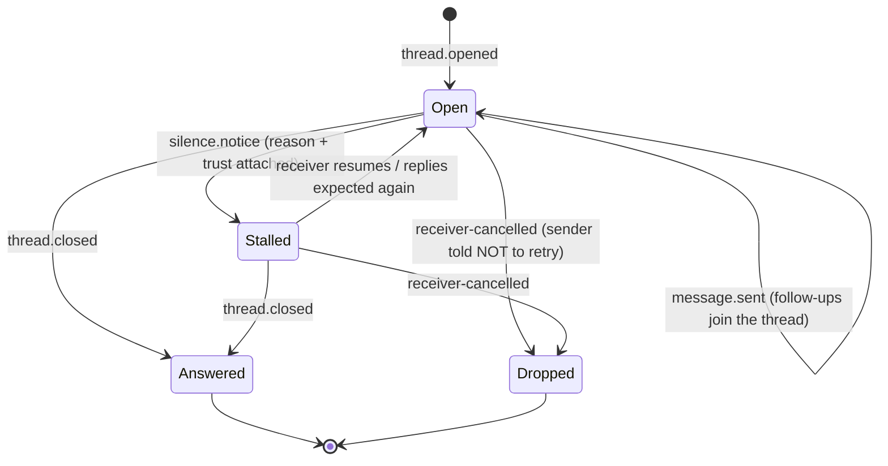
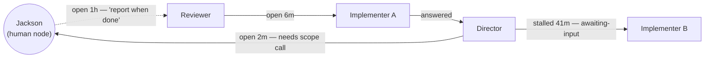

# The Communication Graph

Draft for Jackson (2026-08-14). Purpose: define what the communication graph *is* so we can close the "human as first-class node" question against something concrete. Grounded in the research: Traycer's `epic.communicationGraph.subscribe` (exactly-once, gap-free, playback) and typed-silence system; T3 v2's relationship graph and `delegate_task`.

## The one question it answers

**"Who is waiting on whom, for what, and since when?"**

For a fleet of long-running agents, the expensive failure mode is not a busy agent — it's a *silent stall*: an agent waiting on a reply that will never come, a delegation whose child died, a question to the human nobody surfaced. The communication graph is the primitive that makes stalls visible, attributable, and old-age-sortable.

## What it is NOT

- **Not the spawn tree.** Who-created-whom (`parentId` lineage, T3 v2's root/parent/child/fork/merge-back edges) is *structure*. The communication graph is *conversation*: who is talking to whom right now and who owes whom an answer. The two overlay in UI but are different data. (T3 has only structure; Traycer has only conversation; we render both, distinctly.)
- **Not the transcript store.** Edges carry thread state and intent summaries, not message bodies. Bodies stay in transcripts; the graph links to them.
- **Not a live scrape.** It's a durable log with projections — it survives restarts and supports playback. (Traycer's open threads are RAM-only and die with the host; we explicitly do better.)

## The primitive: a durable communication event log

An append-only, per-epic event log. Subscribers consume it cursor-based with Traycer's contract discipline: strictly ascending, exactly-once, gap-free per cursor — and "snapshot ended" is a batching fact, never a "you're caught up" promise.

Draft event vocabulary:

| Event | Meaning |
| --- | --- |
| `thread.opened` | A reply-expected send minted a `responseId`. Carries sender, receiver, and a one-line **intent summary** (see open question 4). |
| `message.sent` | A message within a thread, or a one-shot (fire-and-forget) delivery. |
| `thread.closed` | The reply arrived. One reply closes the whole thread (idempotent `responseId` semantics, stolen from Traycer). |
| `silence.notice` | Typed silence with the seven-reason taxonomy and trust levels (`turn-ended` authoritative, `quiet` advisory, `awaiting-input`, `receiver-cancelled`, …). |
| `delegation.*` | Open question 1: do v2 `delegate_task` events fold into this same log? |
| `participant.joined/left` | Spawn/archive of a graph participant, so playback renders nodes appearing and retiring. |

## Nodes

- **Agent** — any fleet agent, GUI or TUI, any provider.
- **Human** — Jackson (and later, other people). First-class and addressable by id like any peer. Details below.
- *(Door kept open, not built now: external systems as nodes — e.g. a PR as a node its sitter agent watches. Relevant to the dashboard's PR pane later; noting so the node model doesn't hard-code "node = LLM".)*

## The edge is a thread, not a message

The rendered unit is the **thread** (`responseId`), with a state machine:

Messages are events *within* an edge. This keeps the graph legible at fleet scale — twenty agents exchanging two hundred messages is still only the handful of edges that matter, each colored by state and aged by "open since".

## The human node

Same protocol, different delivery. What's identical to an agent peer:

- Agents address the human by id; `expectReply` mints a thread; the human's reply carries the `responseId` and closes it.
- Human threads are edges in the same graph, events in the same log, visible in the same playback.

What's necessarily different:

- **Delivery is an inbox, not prompt injection.** A `thread.opened` targeting the human lands in the human inbox — which is precisely the core feed of the dashboard's attention queue. This is where Jackson's PR-dashboard "send question/task to the human" mechanism folds in: those sends become ordinary `thread.opened` events targeting the human node, and the separate mechanism disappears.
- **Silence semantics invert.** Agents emit silence notices because hooks tell us their turn ended; humans have no Stop hook. Proposal: threads targeting the human never emit `silence.notice` to the sender — the sender already knows it's waiting on a person (this is exactly the state Traycer's `awaiting-input` exists to name). Instead, *the human's own unanswered-thread count and max-age* become first-class dashboard metrics. Nudging the human is a UX policy question (notification settings), not a protocol event.
- **The human can also be a sender.** Jackson opening a reply-expected thread with an agent ("report when the migration is done") uses the same primitive — and his waiting-on-agents view is the same stall report every agent gets.

## Two channels, one agent — when the human sends through the graph

(Added 2026-08-14 after Jackson's read.) A human message can now reach an agent two ways, and they mean different things:

|  | Chat interface | Inbox thread (via graph) |
| --- | --- | --- |
| Human is watching | Yes — synchronous, sees everything the agent emits | **No** — sees only what comes back on the thread |
| Where the reply must go | Chat text is the reply | The reply tool, carrying the `responseId` |
| Agent's mental model (trained) | Deeply — this is what models are trained for | **Novel — not in the training distribution** |

**The failure mode to design against:** models are trained to put the answer in the chat. An agent that receives an inbox message, does the work, and writes a beautiful final summary *to its own unwatched chat* has — from the human's perspective — gone silent. The work happened; the communication didn't.

Three layers of defense:

1. **The envelope says the quiet part out loud.** Traycer proved protocol-semantics-as-prompt-text works (`[traycer:agent-message]`, "the responseId names a thread…"). Extend it for human-sent inbox messages, roughly: *"This message arrived via your inbox from the human. The human is NOT watching this chat and will see NOTHING you write here. The only thing they will see is what you send back on this thread with responseId=… ."* Envelope wording should be versioned, tunable config — this is novel territory for the models and we will iterate on the text.
2. **Typed silence is the safety net — and for human→agent threads it works fully.** The agent side *has* Stop hooks, so if its turn ends without closing the human's thread, the log gets an authoritative `turn-ended` silence notice and the dashboard shows "did the work, never replied" with a one-click nudge (which can literally re-inject "you have an unanswered thread from the human"). Note the asymmetry: threads *to* the human emit no silence notices (humans have no hooks); threads *from* the human get the full taxonomy.
3. **Role/identity definitions encode the norm.** "When a thread from the human is open, closing it is part of finishing the task" belongs in the soul/role layer, not just the envelope.

**Register is part of the protocol.** Comparing how agents talk to each other over these channels vs how they talk to the human is genuinely informative — agent↔agent messages trend dense and exhaustive (correct: the peer wants completeness), while human-facing replies should be decision-first and one screen. Since the envelope already declares who the counterparty is, it can also set the register expectation, and identity definitions can carry house style for human-facing replies. Open research task: mine live A2A transcripts (including this epic's own Director↔Product exchanges) for agent↔agent vs agent↔human register differences before we write the envelope/role text.

## Projections (what gets rendered from the log)

1. **Live graph tile** — nodes plus thread-edges colored by state, aged by open-duration. The at-a-glance "where is the fleet stuck".
2. **Playback timeline** — scrub through the log to reconstruct "how did we get into this state" (Traycer's best new idea; steal the shape).
3. **Human inbox / attention queue** — projection: open threads where receiver = human, merged with `awaiting-input` escalations from agent↔agent threads. This is the dashboard's primary pane, per the attention-queue-first decision.
4. **Stall report** — open threads sorted by age, weighted by the trust level of the last silence notice (`turn-ended` = really stalled; `quiet` = maybe still working).

## Open questions to close with Jackson

<user_quoted_section>Superseded (2026-08-16): decision tracking for these four questions (now D1–D4) plus the newer design decisions (D5–D7) moved to ../a2a/ — the A2A design session's decision register. The list below is kept for the original rationale only.</user_quoted_section>

1. **Do hierarchical delegations live in the same log?** T3 v2 gives us `delegate_task` (parent→child, durable result) for free. My recommendation: **yes, one unified log** — a delegation *is* a wait, and a graph that omits it lies about who's blocked on whom. Peer threads and delegations become two edge kinds in one graph.
2. **Do ordinary human↔agent chat turns become edges?** Recommendation: **no** — only explicit thread events. Every chat turn as an edge floods the graph into noise. An agent blocked on an in-chat question still surfaces via the `awaiting-input` notice path.
3. **Scope: per-epic or fleet-global?** Recommendation: **per-epic log, fleet-level aggregation in the dashboard.** Keeps the log's delivery contract simple and matches Traycer's proven shape, while the dashboard reads across epics. (Also keeps the door open for cross-machine later: logs replicate per-epic.)
4. **Intent summaries on `thread.opened`?** Recommendation: **yes** — require senders to include a one-line "what I need" so the graph and inbox are legible without opening transcripts. Enforced the way Traycer enforces protocol semantics: as prompt text in the send tool. The inbox is only as good as its subject lines.
