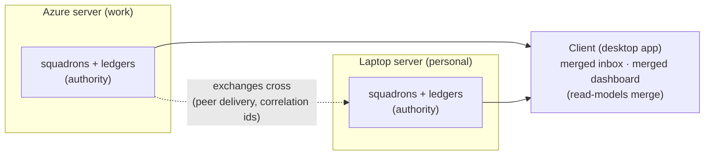

# Cross-device: what crosses, what merges, what stays home

Explored with Jackson 2026-08-19, grounded in the remote-hosting review (`../research/remote-hosting.md`), the A2A design (`a2a/index.md`), and the squadron definition (`features/squadron.md`). **All rulings settled 2026-08-19** — this is the item-5 position of record. Jackson's framing notes: cross-person fleets are a great feature but far off — leave the door open, do NOT design it yet; squadron-spanning is a documented permanent non-goal.

## The organizing principle

State can do exactly three things across devices: **authority can replicate, messages can cross, or read-models can merge.** J5's position: **authority never replicates.** Messages cross (server-to-server delivery of exchanges) and read-models merge (in the client). This dodges Traycer's trap (replicated identity, unbuilt transport, `RECEIVER_NOT_LOCAL`), avoids CRDT/multi-master entirely (anti-constitution), and was pre-built into D5 (log-first) and D8 (async double-entry — "collapsing to one transaction would smuggle in a single-host assumption").

## The four capabilities assessed

| Capability                                   | Architecture verdict                                                                                                                                                                                                                                                                                                                                                                               | Value verdict                                                                                                                                                                                                                                                                                               |
| -------------------------------------------- | -------------------------------------------------------------------------------------------------------------------------------------------------------------------------------------------------------------------------------------------------------------------------------------------------------------------------------------------------------------------------------------------------- | ----------------------------------------------------------------------------------------------------------------------------------------------------------------------------------------------------------------------------------------------------------------------------------------------------------- |
| **Cross-device exchanges between squadrons** | **Fits.** D8's async double-entry is the seam: the delivery worker gains a remote-peer adapter; the receiver's server writes its own `message.received` row. New machinery: a peer registry (URL + bearer token — the fully-local pairing machinery mints these) and the adapter. Log-first delivery gaps, receiver-side silence notices, and correlation-id graph stubs all carry over unchanged  | Low _immediately_ (post-migration, work squadrons co-locate; work↔personal crossing is policy-forbidden). High _later_: multi-box personal setups, per-OS squadrons, and the **cross-person door** — the peer registry is where another person's server attaches, with capability scoping on what may cross |
| **One squadron spanning devices**            | **Requires a different architecture** — replicated authority (CRDT/multi-master) or remote-execution daemons. Both rejected                                                                                                                                                                                                                                                                        | Negative. The E2 argument one level up: why split a squadron when squadrons can exchange across devices? A Mac-needing agent gets a small Mac-homed squadron. Proposed permanent invariant: **a squadron lives entirely on one server** (X1)                                                                |
| **Combined dashboards/inbox**                | **Fits cleanly, needs no server-to-server anything.** T3's client already connects to all saved environments concurrently and merges threads + attention pills; our per-server read APIs (graph cursor streams, inbox projection, stall report) merge the same way. Answers route to origin servers like thread sends already do; offline servers render cached-with-staleness (existing behavior) | **Highest value, nearest term.** Works even before peer messaging exists: one inbox and one board across the Azure fleet + personal fleet. Imposes one cheap constraint today (X2)                                                                                                                          |
| **Other sync**                               | Deliberately none. Worktrees, provider creds, settings, schedules/checks, cost meters: server-local by design; the dashboard merges readouts. Role/identity definitions travel as **git-versioned files** (item 3's direction — now an argument for it, cross-device free). History durability = per-server `state.sqlite` backup (operations, not sync)                                           | Refusing to sync is the feature                                                                                                                                                                                                                                                                             |

## The X-register (all settled with Jackson, 2026-08-19)

| ID  | Ruling                                                                                                                                                                                                                                                                                                                                                                                                                                             | Status                               |
| --- | -------------------------------------------------------------------------------------------------------------------------------------------------------------------------------------------------------------------------------------------------------------------------------------------------------------------------------------------------------------------------------------------------------------------------------------------------- | ------------------------------------ |
| X1  | **A squadron lives entirely on one server — permanent invariant / documented non-goal.** Buys ledger-consistency, recovery, and A2A simplifications forever; the cross-device need is met by squadron-per-device + exchanges                                                                                                                                                                                                                       | SETTLED                              |
| X2  | **Item-4 dashboard panes are multi-environment from day one** (merge feeds like the sidebar merges threads; environment tags on rows; includes future desktop notifications firing for any connected environment). Retrofit is expensive; day-one is nearly free                                                                                                                                                                                   | SETTLED                              |
| X3  | **Sequencing:** dashboard/inbox merge ships with item 4; cross-device exchanges (peer registry + remote delivery adapter) wait for a real trigger (second personal box, Mac-squadron need, or cross-person) rather than being built speculatively                                                                                                                                                                                                  | SETTLED                              |
| X4  | **The peer registry is the designated cross-person seam** — person boundaries, capability scoping on what may cross, and trust live there when the time comes; nothing else in the architecture needs to anticipate cross-person. Jackson: "likely to work" — held as the working assumption, revisited only if the seam proves wrong                                                                                                              | SETTLED                              |
| X5  | **Client-pulled backups** (Jackson's proposal): each connected client periodically pulls a state snapshot from every connected server — the client's existing always-connected fan-out becomes the backup fabric, with no new infrastructure. Design later: server snapshot endpoint (SQLite online-backup API for a consistent copy), pull cadence, client-side retention, restore path. Recorded as the settled direction for history durability | SETTLED (direction; design deferred) |

## What this deliberately does not do

No CRDTs anywhere. No multi-master. No squadron migration between servers. No global agent registry (peering is pairwise). No relay dependency (direct HTTPS peering; a relay could later be _one transport option_ for NAT-crossed personal boxes, never a required service).

## Landed: cross-environment reads for Squadrons and the inbox (2026-09-12, #125, issue #105)

The read-model-merge half of the position above is now built for the web and desktop client. The
Squadron picker, the sidebar scope dropdown, and the inbox combine results from every connected
environment; each server keeps its own Squadrons, threads, ledgers, and inbox identity, and no data
moves between servers. Creation, thread launch, inbox navigation, and replies all carry the owning
environment with the item (`ScopedSquadronRef`, `ScopedThreadRef`) rather than routing through the
primary environment.

Behavior worth knowing:

- **Labels appear only when needed.** Environment labels show on picker rows, scope choices, inbox
  items, and the create form only once results actually span more than one environment; a
  single-environment client looks exactly as it did before.
- **Read-only connections read but cannot act.** A connection without the operate scope displays
  that environment's Squadrons and questions but cannot create a Squadron, launch into one, or send
  an answer; the controls say so.
- **Disconnected sources keep their last results.** An environment that drops or fails to refresh
  keeps its loaded items visible with a per-environment notice; an asterisk on the inbox count
  means the total is incomplete, and a question mark means no positive count is available while
  some environment cannot be refreshed. Servers without the J5 routes are reported as unsupported
  rather than empty.
- **Mobile is deferred.** The native app does not yet include these screens.

FORK case 34 records the upstream-owned files this touches (two optional capability keys, the
contracts and client-runtime export entries) and the shared authenticated transport the client
reads reuse.
