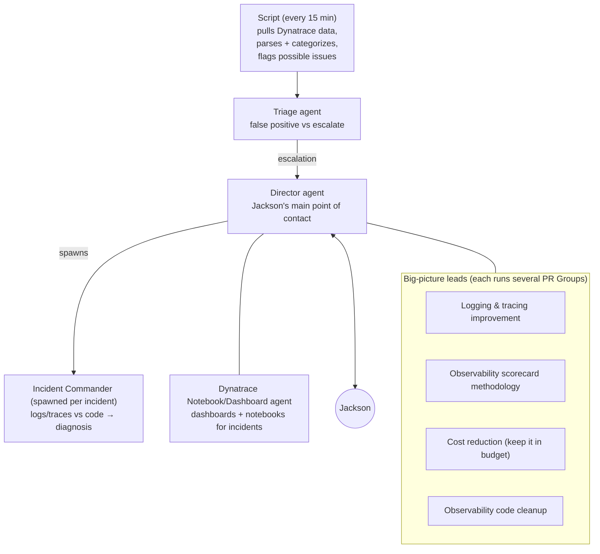

# Fleet vision

Captured verbatim-in-spirit from Jackson (2026-08-14). This is the intent behind the whole product — the context every design decision should be checked against. Companion research: the [prior-art studies](../research/jackson-prior-art/index.md).

## The journey that led here

1. **T3 Code first.** Big workflow win: effortless switching between repos/projects, and a far better interface for running agents in parallel. But its UX is oriented toward _switching between projects and focusing on one agent at a time_ — parallelism without fleet management.
2. **Traycer second.** The peer-to-peer capabilities were the unlock — significantly more complex work became tractable. It also opened an entirely new domain: **agentic monitoring**.

## The working fleet today: observability operations via Dynatrace

Jackson runs a production-monitoring fleet for his job's software. The structure:

## The PR Group — the canonical unit of the vision

Each big-picture lead runs several **PR Groups**: 3 agents that build code changes and manage PRs end-to-end.

| Role         | Responsibility                                                     |
| ------------ | ------------------------------------------------------------------ |
| **Builder**  | Builds the code, tests it                                          |
| **Reviewer** | Independent review; responds to human/agent reviews left on the PR |
| **Sitter**   | Monitors the PR, communicates outside the group, triages CI issues |

Why it's the canonical example: it **requires defined roles** (each agent knows how to act and how to interact with the others) **and A2A communication** to function — the two combine into complex goals achieved with minimal human intervention. And it generates the scale problem that forces the dashboard: enough parallel groups that Jackson needs at-a-glance "what are my agents doing, what state are the PRs in."

Repos (rough beta, workable): `Jacksondr5/pr-group`, `Jacksondr5/pr-group-dashboard`.

## The thesis

<user_quoted_section>We're not creating fleets of agents just to do more parallelized coding. We're building a platform that makes managing large agentic fleets possible — even when the human is not directly managing all the agents.</user_quoted_section>

The human sits at the top of a management hierarchy, not at the center of a hub-and-spoke. Middle-management agents (Director, leads) absorb most coordination; the human's scarce resource is attention, and the platform's job is to route it.

## Product implications (Product lead's read — check designs against these)

1. **Roles + A2A are one load-bearing pair, not two features.** The PR Group only works because role definitions tell agents how to interact _with each other_. Role definitions should be able to reference counterpart roles ("as Sitter, escalate CI failures to Builder; only escalate to your lead when…"). Backlog items 2 and 3 must be designed together.
2. **Machine events are first-class fleet inputs.** The Dynatrace fleet is _driven by a cron job_, not by a human prompt. Work enters the fleet from schedules, alerts, PR comments, CI results. The platform needs non-human triggers as real citizens — and the communication graph should show them as sources (the "external systems as nodes" door we left open).
3. **Fleets are long-lived organizations, not task executions.** Leads and their Crews persist for weeks. This validates: durable communication log, idle-as-real-state, stall detection over completion tracking.
4. **The hierarchy is deep — attention must aggregate.** Jackson ↔ Director ↔ leads ↔ PR Groups is 3+ levels. Escalations bubble through middle managers, so the Fleet page must make _the whole tree's_ state legible, not just the top edge. (The inbox itself stays pure — only asks deliberately sent to the person; the tree-wide view is the Fleet page's job, not the inbox's.)
5. **Cost is a product surface.** One lead exists specifically to keep the fleet within budget. Cost rollups belong on the Fleet page, not in a settings page — per Squadron, with the agents beneath it.
6. **Beyond-coding is the bar.** Every design should pass the test: "does this work for the monitoring fleet, or only for coding fleets?" (E.g. PR panes are one instantiation of a more general "external artifact an agent team is responsible for" — incidents and dashboards are others.)

## History

- 2026-08-14 — captured from Jackson at the start of the project.
- 2026-09-10 — implications 4 and 5 aligned with later definitions (the inbox is pure, so tree-wide attention is the Fleet page's job; cost rolls up per Squadron, nothing between); "teams" replaced by Crews; content otherwise unchanged.
