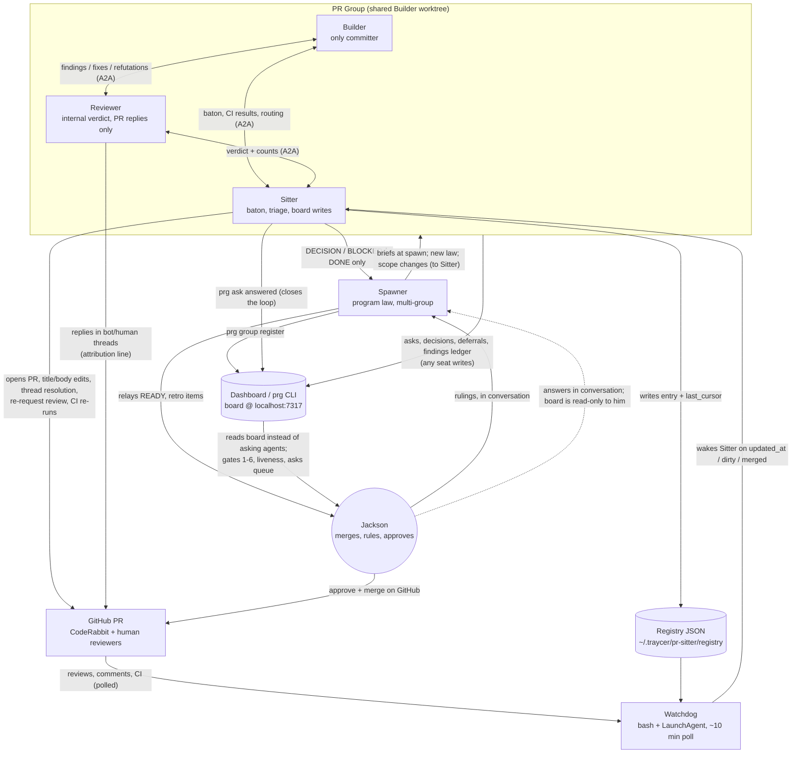

# Prior art: Jackson's `pr-group`

Studied at commit `55bd702ca71b96adafbb2139736c20696971ba20` ("temp", 2026-08-14) of `Jacksondr5/pr-group`. History runs 2026-08-10 → 2026-08-14; commit messages show the playbooks have already been through live runs and retro-driven revision ("fold in retro items from the first live runs", "Jackson's communication clamp — deliberate overcorrection", "dashboard integration — the board replaces status entirely").

**What the repo actually is:** there is no code in it. It is 13 markdown playbooks (~1,180 lines) — a numbered phase sequence (`00-roles` → `07-retire`) plus a `reference/` directory. The _runtime_ lives outside the repo and is referenced by absolute path:

- **Watchdog:** `~/.traycer/pr-sitter/watchdog.sh` — ~150 lines of bash on a LaunchAgent (`ai.fh.pr-sitter-watchdog`), ~10-minute timer, with a JSON registry at `~/.traycer/pr-sitter/registry/<repo>-<pr>.json`.
- **Dashboard:** `~/.pr-group-dashboard/bin/prg` CLI + a board Jackson reads at `http://localhost:7317`.
- **Messaging:** Traycer A2A (`traycer_send_message` / `mcp__traycer_a2a__traycer_send_message`).
- **Model/harness selection:** `~/.traycer/agent-selection-guide.md`.

So the "product" is a prompt-pack + a hand-rolled event system + a hand-rolled status board, glued together by conventions the agents are asked to memorize at bring-up.

Note: it is a **four**-role system, not three. Builder / Reviewer / Sitter are the spawned group; the **Spawner** is a standing fourth role — the agent that created the group, "working with Jackson on the higher level issues," possibly running multiple groups.

## 1. How the roles are defined

Roles are defined entirely in prose playbooks. `00-roles.md` is the identity document every agent reads at bring-up; `01-spawn.md` contains per-role **brief templates** the Spawner fills in and sends as the spawn message. There is no config format, no YAML, no per-role system-prompt file — the role _is_ the brief plus the memorized playbook.

The framing is explicitly anti-rulebook:

<user_quoted_section>"All of the documents in this directory are a map, not a rulebook. It is not a permission system. There is real value in all four of you talking to each other. Use judgment; the nine hard rules below are the only lines that don't bend."</user_quoted_section>

And the README explains why the docs exist at all — the core failure they fix is _mutual legibility_, not discipline:

<user_quoted_section>"They exist because the failure they fix wasn't agents breaking rules — it was agents not knowing who the others were or what each owned, so they hesitated, escalated things already settled, or did the same work twice. Knowing the shape of the group is most of the value."</user_quoted_section>

North star (README): "**communicate to help everyone drive towards great code.**"

### The role table (verbatim ownership column, `00-roles.md`)

| Role         | Owns                                                                                                                                                                     |
| ------------ | ------------------------------------------------------------------------------------------------------------------------------------------------------------------------ |
| **Builder**  | "The code. **The only agent that commits** — any branch, including formatting and rebases"                                                                               |
| **Reviewer** | "An independent correctness verdict. May block. May expand scope. On GitHub it posts **replies only**"                                                                   |
| **Sitter**   | "Coordination and triage. Default address for everything routine. PR metadata, thread state, CI interpretation, the open-findings list. **Never commits, never merges**" |
| **Spawner**  | "Program law — contracts, scope, sequencing, merge order, accepted risk. Decides what reaches Jackson. Breaks ties about _what the system should do_"                    |

Followed immediately by: "**Jackson merges.** Always."

### The nine hard rules (verbatim, condensed)

1. **Only Jackson merges.**
2. **Only the Builder commits.**
3. **Nobody in a group edits shared infrastructure** (the watchdog, the registry, LaunchAgents). Route defects up.
4. **State claims are measured at report time, never recalled.**
5. **A Spawner ruling never reverses something Jackson said.**
6. **A PR isn't mergeable until Jackson has ruled on every deferred finding.**
7. **Every GitHub post opens with `Posted by an AI agent on Jackson's behalf`** — byte-identical every time, never naming Traycer or any model vendor.
8. **Verify, don't accept — including from someone senior to you.** "This has caught wrong claims from a Spawner, a human reviewer, and a Reviewer's own earlier self."
9. **No Jira tickets without Jackson's explicit go.**

### Brief templates — the interesting wording

The Builder brief names the roster by agent id and wires the interaction pattern directly into identity:

<user_quoted_section>"Your group: REVIEWER [id] — reviews your work before the PR opens and after every push; talk to it directly. SITTER [id] — your default address for anything else, and it coordinates who's working when. SPAWNER (me) [id] — decisions and tie-breaks only; tell the Sitter if you come to me."
"Fix the Reviewer's findings, or refute them with concrete evidence... An unresolved high or medium finding blocks opening the PR."</user_quoted_section>

The Reviewer brief is a small masterclass in shaping an AI reviewer:

<user_quoted_section>"Review adversarially, advocate for simplicity. [The builder is strong / this area is subtle / this is compliance-critical — say what makes it worth real scrutiny.]"
"The governing law: [link the standard, decision log, or ruling that applies]... This is the difference between seeing a code path and knowing it violates something. Don't author guidance from a summary; read the source."
"When posting to GitHub, your job is to communicate clearly, not to produce an audit record.... Good: Responding to reviews, communicating decisions that could impact other reviews, asking for clarity. Bad: Posting your own reviews, posting before a question/issue is settled."</user_quoted_section>

The Sitter brief centers the mutex ("the baton") and delegated authority:

<user_quoted_section>"Right now, pre-PR: keep the open-findings list, and hold the baton — the Builder and the Reviewer don't work at the same time. Builder pushes and hands off; Reviewer reviews a stationary tree; hands back. That's your call to sequence."
"You have real authority over PR metadata, thread state, CI interpretation, and re-running failed jobs — use it without asking."
"If you can cite the rule that settles something, apply it and don't escalate."</user_quoted_section>

The Spawner's own playbook (`01-spawn.md`) contains a striking self-limitation about hierarchy and epistemics:

<user_quoted_section>"You supply decisions, constraints, and accepted risks — never hypotheses or mechanisms. If you have a technical theory, send it labelled 'unverified, please refute,' or don't send it... your framings about how code behaves may be missing important details that change the conclusions; your framings about what the system should do have been right."</user_quoted_section>

And a prompt-engineering observation baked into process:

<user_quoted_section>"Keep them roughly this length — a long, numbered, prescriptive brief gets you a long, numbered, prescriptive output. An agent will mirror the structure you hand it, so if you write seven numbered focus areas you'll get a review with seven headings."</user_quoted_section>

Also notable: "**Some things go in all three briefs, not just the brief of whoever will type them.** The agent that _owns a check_ needs the rule as much as the agent that performs the action" — e.g. the PR title format goes to everyone because the Sitter enforces it even though the Builder types it.

### Reviewer behavior on the open PR (`04-rounds.md`)

The single most distinctive product decision: **the Reviewer never posts a review of its own to the PR.** Its verdict is internal (to Builder + Sitter records); the PR thread carries _only replies_ to CodeRabbit and humans:

<user_quoted_section>"| Your verdict, first pass or delta | Internal. It goes to the Builder and the Sitter's records — never the PR || Anything else — status, delta confirmation, summary, 'review clean' | Nothing. There is no post for these |"
"Investigate privately; post conclusions. A PR thread is a landing zone for decisions, not a lab notebook... a sequence like 'two things gate this' → 'correcting my previous comment' → 'I was wrong' → 'new verdict' reads as thrashing to a human scrolling the thread, even when the investigation behind it is excellent."
"You're communicating, not producing an audit record. Nobody is grading your diligence... You have permission to say almost nothing."</user_quoted_section>

Findings sent to the Builder have a mandated shape — "lead with the ask, not the evidence" — with a structured template (`F-3 MEDIUM — ... / reviewed SHA / required / mechanism / suggested fix / owner / status`) and a required **staleness triple** on every routed finding: `reviewed SHA / current SHA / still applicable?`.

## 2. How the agents communicate

Five distinct channels, each with an explicit audience and noise budget:

1. **Traycer A2A messages** (`traycer_send_message`) — all intra-group traffic: findings, baton handoffs, head moves, CI interpretation. Free-form; "the group talks to itself... with a high degree of independence."
2. **GitHub PR threads** — the _outward-facing_ channel to CodeRabbit and human colleagues. Heavily rationed (replies only, attribution line, one post per settled disposition). Posts go out under Jackson's own login (`Jacksondr5`), which is why hard rule 7's byte-identical marker line exists — it is literally the only way to distinguish agent posts from Jackson's.
3. **The dashboard** (`prg` CLI + local web board) — the channel to _Jackson_. Asks, decisions, deferrals, the findings ledger, group roster, liveness. "Jackson reads the board... **instead of asking agents how it's going**." Board is deliberately read-only to him; agents must close every loop (`prg ask answered`).
4. **The watchdog + registry** — the _event_ channel: JSON files that tell the watchdog which agent to wake about which PR, and cursor timestamps that gate re-wakes.
5. **The Sitter's Traycer artifact** — per-PR memory: a timestamped `## PR log` "for whoever picks this up after you, including a human."

### The noise-control regime

Communication _upward_ is aggressively clamped (a commit calls it "Jackson's communication clamp — deliberate overcorrection"). The Sitter may send the Spawner exactly: **DECISION**, **BLOCKED**, and **PR READY FOR MERGE / DONE**. Rationale, verbatim:

<user_quoted_section>"Everything you send the Spawner surfaces in Jackson's conversation view with it — your traffic is directly the human's noise, and it has buried things he actually needed to act on in the past."</user_quoted_section>

BLOCKED is narrowly defined: "Waiting on CI is not blocked. Waiting on a human approval is not blocked — that's a queue item." And routing is audience-split: "The board reaches **Jackson**; the BLOCKED message reaches **the Spawner**... Never both for one item."

There's an entire section policing Traycer's `expectReply` flag:

<user_quoted_section>"Set expectReply: true only if you can write down the question you need answered.... It is not a read receipt, not a request for confirmation, and not 'tell me when you're done'... Acknowledgments are a symptom of a misused flag, not a politeness requirement."</user_quoted_section>

Non-events are explicitly non-messages: the Sitter does _not_ tell the Spawner the PR opened ("the PR's existence is visible on the dashboard the moment you attach it"), and a backport opening is likewise announced only via `prg pr attach --role backport`.

### Communication flow

## 3. Lifecycle

**Spawn (`01-spawn.md`).** The Spawner settles goal/scope/base-branch first ("Make it checkable, not aspirational... If you don't have this, push back"), then spawns Builder + Reviewer + Sitter _together, before the PR exists_, all bound to **the Builder's worktree** — because "a Reviewer on the wrong worktree doesn't get errors, it gets **wrong answers**... That exact failure shipped a wrong approve-as-is verdict once; CI caught it, not the reviewer." Agents are named for the ticket, not the PR (the PR doesn't exist yet and "agents cannot be renamed after creation"). Then `prg group register` — the Spawner must do it because "you are the only agent that certainly knows all three ids." Then: "step back. Silence from a PR group is the expected state, not a problem to investigate."

**Pre-PR (`02-pre-pr.md`).** A strict alternation: Builder builds → hands off → Reviewer reviews a _stationary_ tree → findings to Builder → fix or refute. The Sitter holds the baton (a hand-rolled mutex over a shared worktree). Gate: "**An unresolved high or medium finding blocks opening the PR.**" Escape hatch: Builder can ask the Sitter to open a _draft PR_ just to run CI when local checks are slow/flaky. Incident exception: hotfixes run review and CI in parallel.

**PR open (`03-pr-open.md`).** The Sitter creates the PR (owns title/description format), writes its watchdog registry entry, runs `prg pr attach` ("An unattached PR doesn't exist as far as Jackson is concerned"), and creates its per-PR artifact. From here on, its wake discipline is the **state card**: "a short list of facts you re-derive at the top of every wake, never answer from memory" — mostly automated as `prg gates --pr <n>`, plus two irreducibly internal facts: the Reviewer's standing verdict and its anchored SHA, and "**Who owns the next action.** If you can't name the owner, the PR is drifting and you're the one who hasn't noticed."

**Triggers.** The watchdog polls GitHub every ~10 minutes per registry entry and wakes the Sitter via Traycer message on: `updated_at` > cursor, `mergeable_state == dirty` (once per episode), or merge/close (nudge to finalize, then FORCED-DONE to the coordinator). Crucially, **CI completions and conflicts emit no GitHub events**, so the Sitter must poll `check-runs` and `mergeStateStatus` itself on every wake. The dashboard poller independently measures gates 1-6 continuously.

**Rounds (`04-rounds.md`).** Event routing table: CI failure → Sitter diagnoses before routing ("Never forward a raw red check"), Builder decides on flakes; CodeRabbit review → Reviewer triages all items, routes fixes, posts _once per thread after the Builder pushes_; human review → same shape "more deference" ("Defer to humans on context and priorities. Verify everyone's facts against the tree"); deferral → Sitter → Spawner → Jackson. Deferrals are deliberately rare: "The cheapest moment to fix a finding is **now, in this PR, while the context is loaded.**"

**Ready (`05-ready.md`).** Ten gates. 1-6 are machine-measured (`prg gates` — human `APPROVED` via `reviewDecision`, CI green _on the exact head with a run that exists_, mergeability at alert time, base is a real merge target, threads resolved, every CodeRabbit finding disposed). 7-10 are judgment: Jackson-ruled deferrals, **a negative control** ("feed it something that should fail, and confirm it does"), named coverage limitations, and code CI structurally cannot reach. READY goes on the board as a blocking ask _and_ up as a DECISION; "The Spawner tells Jackson. **Jackson merges.**" Plus: "Being stricter than this list is correct... This list is a floor, not a ceiling."

**Backport (`06-backport.md`).** A `release/**` merge auto-opens a backport PR to `main`; **the same group takes it over** (new registry entry, `prg pr attach --role backport`, no new group). First act: grep the diff for committed conflict markers before reading any CI, because the workflow commits raw `<<<<<<<` markers by design and the resulting red CI cascade "tells you nothing." The one rule: "**Never change functionality on a backport.**"

**Retire (`07-retire.md`).** Sitter: final PR-log entry → registry `state: "done"` → close every open ask/finding on the board ("**Jackson cannot clear these himself**... An ask you leave open sits on his screen forever") → collect retro items from Builder and Reviewer → DONE to Spawner → "**Say you're retiring**, then idle. Don't just go quiet." Builder/Reviewer are "released at merge... You may be re-engaged... so don't discard state — just stop working." The Spawner surfaces retro items to Jackson unfiltered and reaps worktrees. Retirement is reversible: `prg group reopen` for post-merge findings (a soak result, a prod signal).

## 4. Human interaction points

Jackson appears in exactly four ways:

1. **The board is his status view.** He never asks "how's it going" — gates 1-6, liveness, and the asks queue are on the screen. The "never-ask test": "_could a script find this out by reading GitHub?_ If `prg gates` lists it under MEASURED, it is already on his screen, and filing it buries the things that aren't."
2. **Asks are the "send question/task to the human" mechanism** — and yes, it exists here, not just in the dashboard repo; the playbooks are its usage contract. `prg ask --urgency blocking|soon|fyi`. Design rationale, verbatim: "Messages get missed once and are gone; **a row survives until someone acts on it.**" Only things "**only a human judgement can supply** — a ruling, a tie-break, a ticket go-ahead, an environment action" qualify. The board is read-only to Jackson "because an item he cleared silently would leave the group believing it was never answered" — he answers in conversation, and the Sitter records it with `prg ask answered`, forcing the agents to close every loop.
3. **He holds the irreducible authorities:** merge (always), GitHub approval (agents can't approve — they post from his account), rulings on every deferral (gate 7), Jira ticket creation (hard rule 9), and reversals of his own prior statements (a Spawner can't).
4. **Retro items** flow up once at DONE, unfiltered: "the group sees friction that nobody above it can, and it's the only channel that carries it."

Urgency inflation is explicitly policed: "`blocking`... sorts to the top and is the loudest thing on the board. Using it for something merely important is how the loud channel stops being loud."

## 5. What worked vs what's duct tape

**Worked (per the docs' own evidence claims):**

- Role legibility itself — the whole repo exists because agents "hesitated, escalated things already settled, or did the same work twice" without it.
- The board replacing status conversation (a dedicated commit: "the board replaces status entirely").
- Shared worktree for the Reviewer (its absence shipped a wrong approve verdict).
- Verify-don't-accept — caught wrong claims "from a Spawner, a human reviewer, and a Reviewer's own earlier self."
- Briefs carrying the decision log: "The highest-severity finding of the whole program came from a Reviewer whose brief carried the decision log; a predecessor with the same code and no decision log saw the same path and under-weighted it."
- The findings ledger with refutations recorded ("the reasoning that stops the same finding being re-raised next round").

**Duct tape (self-acknowledged):**

- The watchdog. `reference/watchdog.md` reads as a known-defects register: no alert path for `DELIVERY-FAILED` ("The failure mode that silences everything is the only one without an alarm"); "Delivery success has been well below 100%"; log lines that "claim success for a message that never arrived"; hardcoded `epic_id` and sender id; laptop-sleep blindness; nothing auto-arms backports; STUCK false-alarms on quiet PRs ("the real liveness heartbeat is the measurement, not the cursor").
- Cursor discipline — a page of rules culminating in a landmine: "**`last_cursor` must never equal the PR's `updated_at`**... It's the single value that silently ends your ability to be woken."
- Playbook staleness: "Editing a playbook does **not** change how a running agent behaves — it acts on what it memorized at bring-up... a standing agent kept routing to a stale target for days after its playbook was retargeted, and it was caught only by a deliberate drill."
- The GitHub mechanics file is titled "things five Sitters each learned the hard way" — an accreted trap list (zsh SHA-mangling misread as "file doesn't exist," string `in_reply_to` failing silently, PATCH nulling bodies, stale `git branch -r`).
- Fighting the host repo's own automation: the monorepo's review skills must be explicitly disclaimed at spawn or "a Builder follows the repo skill in good faith and spawns its own reviewer and verifier batches, which happened."
- The `07-retire.md` wishlist is an admitted gap: "An alarm should fire without anyone watching, on: no state change in N hours; a push with no CI run object after ~2 hours; base divergence...; a review requested with no response; and **waiting on Jackson**... It fires to the Spawner and escalates on its own if unacknowledged." None of that exists yet.
- Latest commit is literally titled "temp."

## What the platform should give for free

Everything below is scaffolding Jackson hand-built (or hand-documented around the absence of) that a real fleet-management platform should provide natively:

1. **Reliable, verified agent wake/event delivery.** The watchdog is a bash script on a LaunchAgent with sub-100% delivery, no delivery-failure alarm, success-claiming logs, and cursor rules that can permanently silence an agent. The platform needs guaranteed-delivery events with read receipts, dead-letter alerting, and no agent-managed cursors.
2. **External-event subscriptions (GitHub webhooks, CI, conflicts) as first-class triggers.** Half the Sitter playbook is compensating for GitHub facts that emit no event (`check-runs`, `mergeable_state`, child-object `updatedAt` skew, retroactive edits). Agents should subscribe to "CI finished on head X" / "PR went dirty," not poll on every wake.
3. **Group/team as a primitive.** Roster registration (`prg group register`), member ids hand-copied into briefs, "if you don't know who someone is, ask the Sitter — don't guess" — the platform should give every agent an authoritative, live roster with roles, so a wrong hand-copied id can't silently misreport liveness.
4. **A human queue with survivable items and forced loop-closure.** The entire ask/answer machinery: durable rows vs. missable messages, urgency levels with anti-inflation semantics, read-only-to-human by design, `ask answered` closing the loop. This is the heart of the dashboard and screams "platform feature."
5. **Measured status instead of asked status.** The board's gates 1-6 + the "never file an ask the board already measures" test. Generalized: the platform should continuously derive whatever a script can read from external systems, and reserve agent→human bandwidth for judgment.
6. **Agent liveness from transcript state, not activity.** The board's idle-vs-stalled call (transcript tail ends in completed response = healthy however quiet; unanswered message = stalled) demonstrably beats wake-count heuristics ("three agents quiet 51+ hours were all healthy while the one genuinely dead agent had been quiet only 28"). Plus the missing-alarms wishlist: no-state-change clocks, push-without-CI-run, waiting-on-human with a longer clock, auto-escalation if unacknowledged.
7. **Work-item / findings ledger with lifecycle.** `finding add/fix/refute/defer/supersede`, staleness triples (`reviewed SHA / current SHA / still applicable?`), one-home-per-finding, deferral→ruling linkage. A generic tracked-item primitive with states, owners, and human-ruling gates.
8. **Role definitions as live configuration, not memorized prose.** The bring-up-memorization model means every playbook edit requires manually notifying running agents and proving the change with a drill. The platform should version role definitions and push updates (or at least notify affected agents automatically).
9. **Concurrency control over shared workspaces.** "The baton" is a socially-enforced mutex over the Builder's worktree, sequenced by a third agent by hand. Locks/leases on a workspace, with the platform knowing who holds the tree.
10. **Identity and attribution for external posting.** All agents post as `Jacksondr5`; a byte-identical marker string is the only provenance mechanism, and any drift breaks downstream tooling. The platform should own external-identity attribution (per-agent identity or enforced, machine-verified attribution).
11. **Lifecycle management: spawn-with-context, retire, reopen, reap.** Registration at spawn, `group done` with open-item enforcement, `group reopen` for post-merge findings, Spawner manually reaping un-retired groups and worktrees ("an un-retired group costs... ambiguity about who owns the PR"). Also: agents can't be renamed after creation — naming had to be designed around.
12. **A retro/feedback channel.** Retro items ride the DONE message and depend on the Spawner relaying them unfiltered. A platform should collect structured post-mortem friction from every group as a matter of course.
13. **Environment/knowledge base for hard-won operational facts.** `known-flakes.md` and `github-mechanics.md` are institutional memory in markdown, manually maintained ("A living list. Add to it when you confirm something"). A fleet platform should have a shared, curated ops-memory store agents can both read and append to.
14. **Isolation from the host repo's competing automation.** The Spawner must verbally disclaim the monorepo's own review skills at every spawn. The platform should let a fleet declare which repo-level automations are superseded within its scope.
