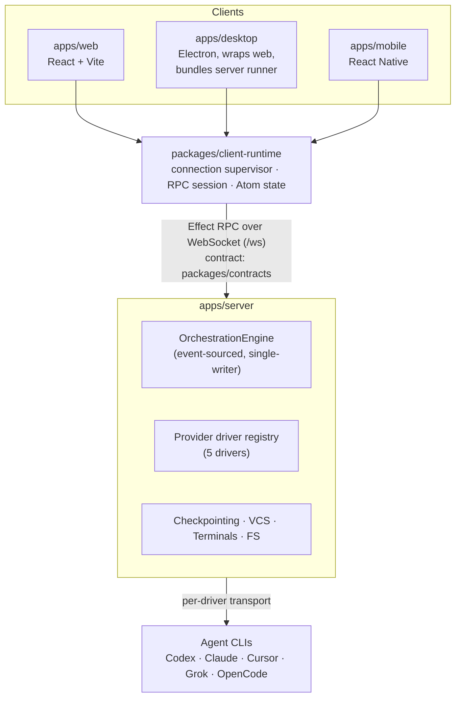
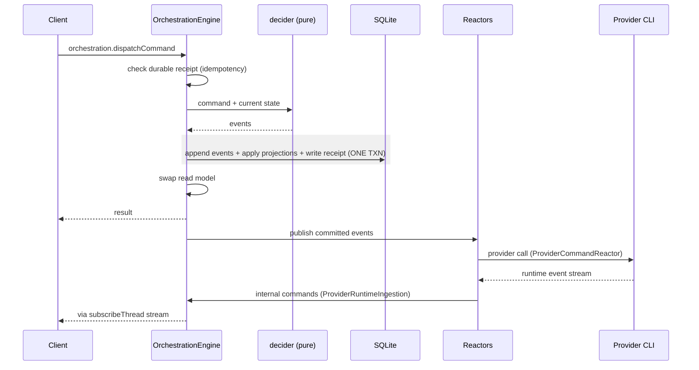

# Architecture map

## Process model

One runtime boundary. A client talks to **one T3 server** over HTTP + WebSocket; that server owns orchestration, providers, terminals, git, and filesystem. Remoteness is expressed at the connection layer only — the runtime is never split.



## Tech stack

| Layer           | Choice                                                                                                                                           |
| --------------- | ------------------------------------------------------------------------------------------------------------------------------------------------ |
| Language        | TypeScript throughout; **Rust** for `native/resource-monitor`; **C ABI** (`libghostty-vt`) for terminals                                         |
| Runtime         | Node `^24.13.1`                                                                                                                                  |
| Effect system   | `effect` (the `effect-smol` beta line, `4.0.0-beta.103` catalog) — Effect is used pervasively on the server and in `client-runtime`              |
| Build           | **Vite+ (`vp`)** as the monorepo task runner, formatter, linter, and test runner; `@effect/tsgo` / `@typescript/native-preview` for typechecking |
| Package manager | pnpm 11.10.0, workspace catalog for version pinning                                                                                              |
| Client state    | `@effect/atom-react` (Atom factories), TanStack Router (`routeTree.gen.ts`)                                                                      |
| Lists           | `@legendapp/list` (shared web + mobile)                                                                                                          |
| Diffs           | `@pierre/diffs` + a web worker pool                                                                                                              |
| DB              | SQLite (`NodeSqliteClient.ts`); relay uses PlanetScale                                                                                           |
| Auth (cloud)    | Clerk (web, desktop via `@clerk/electron`, mobile via `@clerk/expo`)                                                                             |
| Cloud infra     | Cloudflare Workers + tunnels, deployed with **Alchemy**                                                                                          |
| Lint            | oxlint + a **custom in-repo plugin** (`oxlint-plugin-t3code`)                                                                                    |

## Monorepo layout

```
apps/
  web        825 files  React/Vite UI — the main client
  mobile     672 files  React Native (iOS + Android)
  server     604 files  WebSocket, orchestration, providers, checkpointing
  desktop    151 files  Electron shell, SSH, updates, preview windows, WSL
  marketing   53 files  Site
packages/
  client-runtime 148  connection lifecycle, auth, RPC, domain Atom factories (web+mobile)
  shared          98  runtime utils, subpath exports, no barrel
  contracts       56  Effect/Schema wire contracts + small derived helpers
  effect-acp      21  Agent Client Protocol (Cursor, Grok) — generated + handwritten
  effect-codex-app-server 19  Codex app-server protocol
  ssh             11  SshEnvironmentManager, tunnels
  tailscale        5  tailscale serve management
infra/relay        78  Cloudflare Worker: T3 Connect relay
native/
  libghostty-vt   32  pinned upstream VT engine (Android .so + web .wasm)
  resource-monitor 3  Rust process/resource sampler
oxlint-plugin-t3code   custom lint rules
.repos/                vendored READ-ONLY reference repos (effect-smol, alchemy-effect)
```

`.repos/` is a notable convention: upstream sources vendored for agents to _read patterns from_ and forbidden to import or edit. AGENTS.md: _"Prefer their patterns over invented ones."_

## The wire: Effect RPC, not a hand-rolled push bus

`packages/contracts/src/rpc.ts` (1,075 lines) declares `WS_METHODS` and assembles `WsRpcGroup`. Each member is either **unary** or a **server stream** (`stream: true`). ~90 methods; the streams are:

`orchestration.subscribeThread`, `orchestration.subscribeShell`, `terminal.attach`, `subscribeTerminalEvents`, `subscribeTerminalMetadata`, `subscribeVcsStatus`, `subscribePreviewEvents`, `previewAutomation.connect`, `subscribeServerConfig`, `subscribeServerLifecycle`, `subscribeAuthAccess`, `subscribeBackgroundPolicy`, `subscribeResourceTelemetry`, `subscribeDiscoveredLocalServers`, `git.runStackedAction`, `server.updateServerWithProgress`, `cloud.installRelayClient`.

This replaced a broadcast push bus: **a client subscribes to what it needs, and the server pushes only on that subscription.** That is the structural fix for the March "everything to everyone" problem.

`apps/server/src/ws.ts` mounts `GET /ws`, authenticates the upgrade through `EnvironmentAuth.authenticateWebSocketUpgrade`, then hands the socket to `RpcServer.toHttpEffectWebsocket`. **Authorization is per method** — `RPC_REQUIRED_SCOPES` in `apps/server/src/auth/RpcAuthorization.ts` maps each method to a scope. Holding a valid socket is not authorization to call everything on it.

On the client, `packages/client-runtime/src/rpc/session.ts` opens the socket and builds the typed client. A session performs **one attempt and never retries** — retry, backoff, and offline policy live in the connection supervisor. Clean separation.

## Orchestration: event-sourced CQRS, single-writer

`apps/server/src/orchestration/Layers/OrchestrationEngine.ts`. `dispatch` offers a `CommandEnvelope` onto `commandQueue` and awaits its result; **a single worker fiber takes envelopes one at a time**, so command processing is totally ordered. For each envelope, `processEnvelope`:

1. checks the **durable command receipt** — retries are idempotent;
2. runs `decideOrchestrationCommand` (`decider.ts`) — pure, side-effect free, command + state → events, with preconditions in `commandInvariants.ts`;
3. **inside one SQL transaction**: appends events to the event store, applies them to the in-memory read model via `projector.ts`, projects them into persisted tables, and writes the accepted receipt;
4. after commit: swaps in the new read model and publishes committed events to subscribers.

Because persistence and projection share a transaction, the read model cannot durably disagree with the event log. On dispatch failure the engine rereads persisted events past the starting sequence and reconciles.



**Command/event naming is disciplined**: commands are imperative (`thread.turn.start`), events are past tense (`thread.turn-start-requested`, `thread.created`). Some commands are client-dispatchable; others (`thread.message.assistant.delta`, `thread.turn.diff.complete`) are internal and only produced by server-side reactors.

Glossary shortcut from the docs: _"`requested` → intent recorded. `completed` → result applied. `receipt` → async milestone signal, for tests."_

## Reactors and drainable workers

Follow-up work runs in queue-backed workers built on `packages/shared/src/DrainableWorker.ts` (70 lines):

- **`ProviderRuntimeIngestion`** — normalizes provider runtime streams into orchestration commands. Owns buffered assistant delivery.
- **`ProviderCommandReactor`** — dispatches provider calls in response to intent events.
- **`CheckpointReactor`** — captures baseline and completed-turn checkpoints, projects diffs, performs reverts.

`DrainableWorker` pairs a transactional queue with a transactional count of outstanding items: `enqueue` atomically offers and increments, processing decrements, `drain` retries until the count reaches zero. All three expose `drain`, so tests await "queue empty **and** current item finished" rather than sleeping.

**`RuntimeReceiptBus`** publishes typed async-milestone receipts (`checkpoint.baseline.captured`, `checkpoint.diff.finalized`, `turn.processing.quiesced`). Notably, `RuntimeReceiptBusLive` — the production layer — **publishes nothing**; only the test layer is PubSub-backed. The docs are explicit: _"Do not build production behavior on receipts."_ This is a mature refinement of the March design: the mechanism was kept for determinism in tests and deliberately denied any production role.

## Provider drivers

Two registries separate configuration from live processes:

- `ProviderInstanceRegistry` keys configured instances by `ProviderInstanceId`; creating one looks up the driver by `driverKind`, decodes `entry.config` with **that driver's own schema**, opens a child scope, and calls `driver.create`.
- `ProviderAdapterRegistry` resolves an instance ID to its live adapter.

`ProviderService` sits on top and routes session/turn operations for a _thread_, so callers name a thread, not an agent. The adapter contract (`ProviderAdapter.ts`) is ~15 members: `startSession`, `sendTurn`, `interruptTurn`, `respondToRequest`, `respondToUserInput`, `stopSession`, `listSessions`, `hasSession`, `readThread`, `rollbackThread`, `stopAll`, plus `provider`, `capabilities`, and `streamEvents`.

## Persistence

SQLite via `NodeSqliteClient.ts`. **40 numbered migrations** in `apps/server/src/persistence/Migrations/`, several with their own tests, some being data backfills or cleanups (`024_BackfillProjectionThreadShellSummary`, `025_CleanupInvalidProjectionPendingApprovals`, `026_CanonicalizeModelSelectionOptions`).

Two families of tables:

- **Event store + receipts** — `OrchestrationEventStore.ts`, `OrchestrationCommandReceipts.ts`.
- **Projections**, one service per read concern — `ProjectionThreads`, `ProjectionThreadMessages`, `ProjectionThreadActivities`, `ProjectionThreadSessions`, `ProjectionThreadProposedPlans`, `ProjectionTurns`, `ProjectionCheckpoints`, `ProjectionPendingApprovals`, `ProjectionProjects`, `ProjectionState`.

Migration history reads as a performance changelog: `019_ProjectionSnapshotLookupIndexes`, `029_ProjectionThreadDetailOrderingIndexes`, `030_ProjectionThreadShellArchiveIndexes`, `037_ProjectionTurnsKeysetIndex`. Also `031_AuthAuthorizationScopes` — a deliberate **hard cutover** from role-bearing to scoped auth records that deletes existing pairing links and sessions rather than silently mapping old `owner`/`client` roles to new capabilities. Correct call, and documented as such.

State lives under a T3 home directory; worktree dev state defaults to a gitignored `.t3` that _deliberately outranks_ an ambient `T3CODE_HOME` so agents can't land on shared state by accident.

## Client runtime

`packages/client-runtime` holds every non-visual client concern: connection lifecycle, auth, RPC, cached environment data, and domain state as Atom factories. Web and mobile compose it identically — `apps/web/src/connection/runtime.ts` and `apps/mobile/src/connection/runtime.ts` mirror each other, differing only in platform-specific background-activity layers.

Hard rules from `docs/internals/connection-runtime.md`:

- The **supervisor is the only retry owner**. Transient failures retry forever with exponential backoff capped at 16s; a connection stable for 30s resets accumulated backoff. Auth/config failures stay blocked until an external wakeup.
- React components never construct transports, retry loops, or RPC clients.
- The UI does **not** infer connection health from cached data or the existence of a transport object. `connected` means the socket opened _and_ the initial config RPC succeeded.
- Shell and thread synchronization are independent data states. "A healthy RPC transport with a failed shell subscription is shown as connected with a synchronization error, not as a reconnect that is not actually scheduled." — this is the anti-lying-spinner rule made structural.
- The package **has no root export**; consumers must import explicit subpaths. Non-exported files are implementation details by construction.

## Startup

`serverRuntimeStartup.ts` runs a fixed lifecycle: keybindings → settings → reactors → publish welcome → signal **command readiness** (logged `Accepting commands`) → wait for the HTTP listener (`markHttpListening`) → publish ready → fork heartbeat → headless output or open browser. Command readiness precedes the listener, so a socket that opens can already dispatch. That ordering removes a whole class of startup race.
