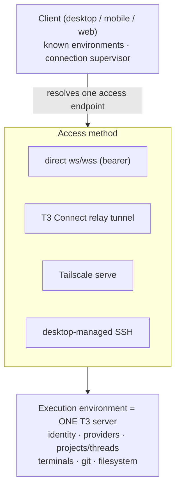

# Remote & multi-machine

<user_quoted_section>March status: one server bound to a LAN IP with a static token the browser client never sent. No sync, no relay, no pairing.
Current status: "Remote environments are shipped, not planned." Five access methods, a deployed cloud relay, a capability-scoped auth system, and push notifications to phones.</user_quoted_section>

## The model

One runtime boundary. Remoteness lives entirely at the connection layer — **the runtime is never split**.



**`ExecutionEnvironment`** = one running T3 server. Identified by a stable `environmentId` persisted at `<stateDir>/environment-id`, generated on first start (`apps/server/src/environment/ServerEnvironment.ts`). Desktop, mobile, and web all reason about the same concept.

**There is no state sync between environments.** This is the key architectural fact and it is deliberate. A client holds a *catalog* of known environments and connects to one at a time. `RepositoryIdentity` exists purely as a best-effort logical repo grouping for UI correlation — the docs say **"never for routing."** A local clone and a remote clone are different projects that happen to share a `RepositoryIdentity`; threads bind to one project in one environment.

For our project: if we want cross-machine thread sync or a global inbox spanning environments, **T3 does not have it** and its docs list "richer multi-environment UI" under Future Work. That's an open space, and also a warning about how much complexity T3 chose to avoid.

## Connection targets

`packages/client-runtime/src/connection/model.ts` — four tags, the real access taxonomy:

| Target | Used for | Persisted? |
| --- | --- | --- |
| `PrimaryConnectionTarget` | Platform-managed local server (desktop backend, CLI-served web app) | No — platform-managed |
| `BearerConnectionTarget` | Any manually paired endpoint over direct HTTP/WS | Yes |
| `RelayConnectionTarget` | Managed T3 Connect relay tunnels | Yes |
| `SshConnectionTarget` | Desktop-managed SSH environments | Yes |

**Tailscale is deliberately not a target kind.** A Tailscale URL pairs through the ordinary bearer path (`preparePairingRegistration` in `connection/onboarding.ts`). Tailscale is an endpoint *provider* and transport, not a distinct runtime concept. Good taxonomy discipline — the axis that matters is "how do I speak WebSocket," not "what product got me there."

## Advertised endpoints

A server or desktop authors `AdvertisedEndpoint` candidates: an HTTP + WS base URL pair, a default/available/unavailable marker, reachability hints (`loopback`, `LAN`, `private`, `public`, `tunnel`), and compatibility hints such as whether the hosted HTTPS app can use it.

**Clients treat advertised endpoints as hints, not proof.** The connection attempt decides.

`selectPairingEndpoint` excludes unavailable endpoints then picks, in order:

1. saved `defaultEndpointKey` override → 2. first `isDefault` → 3. first non-`loopback` → 4. first hosted-HTTPS-compatible → 5. nothing.

**There is no unconditional loopback fallback.** Loopback only wins via explicit override or `isDefault`. That prevents the classic "works on my machine, silently connects to localhost for everyone else" failure. Overrides persist by *stable endpoint kind* rather than raw URL, because LAN addresses change with networks; Tailscale uses provider-specific stable keys (`tailscale-ip:`, `tailscale-magicdns:`).

## Auth — the part that was broken in March

Capability-based, OAuth-shaped. `docs/internals/environment-auth.md`.

### Scopes

| Scope | Permission |
| --- | --- |
| `orchestration:read` | Read snapshots, status, events, config, filesystem/VCS state |
| `orchestration:operate` | Dispatch user operations, mutate workspace state |
| `terminal:operate` | Create/attach/input/resize/clear/restart/terminate terminals |
| `review:write` | Read review diff previews for composing feedback |
| `access:read` | Inspect pairing links and client sessions |
| `access:write` | Create or revoke pairing links and client sessions |
| `relay:read` | Inspect managed relay connectivity |
| `relay:write` | Link, configure, unlink managed relay connectivity |

Ordinary pairing links grant the first four plus `relay:read`. Desktop bootstrap and CLI admin bootstrap credentials additionally grant `access:read`, `access:write`, `relay:write`. **Requested scopes must be a subset of the bootstrap grant** — a paired client cannot escalate to `access:write`.

### Four authentication flows

1. **Browser session** — `POST /api/auth/browser-session` consumes a one-time bootstrap credential and sets an HTTP-only cookie. The session secret is never exposed to browser JavaScript.
2. **Bearer access token** — `POST /oauth/token` using **RFC 8693 token exchange** (`grant_type=urn:ietf:params:oauth:grant-type:token-exchange`, `subject_token_type=urn:t3:params:oauth:token-type:environment-bootstrap`). 30-day default TTL. Clients may pass `client_label`/`client_device_type`/`client_os` as *presentation hints only* — explicitly not used for authorization, with transport metadata derived server-side.
3. **DPoP-bound access token** — same endpoint; a `DPoP` header is verified by `verifyRequestDpopProof`, the JWK thumbprint is stored on the session, and the token is issued with method `dpop-access-token` and a **1-hour** TTL. An invalid proof gets a DPoP challenge header, not a bearer fallback. **Relay-brokered clients use this mode so a leaked token cannot be replayed without the key.** `sessionMethods` in the descriptor advertises support, so clients discover rather than assume.
4. **WebSocket ticket** — `POST /api/auth/websocket-ticket` takes any authenticated session (credential in *headers*) and returns a short-lived, single-purpose ticket, default **5-minute** TTL. Only that ticket is appended to the socket URL as `wsTicket`.

The March flaw is now structurally impossible: long-lived credentials and cookies never appear in WebSocket URLs, and **every RPC method independently enforces its scope** via `RPC_REQUIRED_SCOPES`. *"Creating a ticket is not authorization to call every RPC method."*

Migration `031_AuthAuthorizationScopes` was a **hard cutover** — it deletes existing pairing links and sessions rather than mapping old `owner`/`client` roles onto new capabilities. Everyone re-pairs. The right call, and documented as intentional.

## Access method 1 — direct WebSocket (bearer)

`wss://t3.example.com` or `ws://10.0.0.15:3773`, paired as a bearer target. The base model; works on all three clients with no client-side process management.

Browser security is treated as part of the model, not an afterthought: **a hosted HTTPS client cannot connect to plain `ws://`/`http://` LAN backends.** HTTP LAN endpoints must use direct desktop or CLI pairing URLs.

### Hosted pairing

```
https://app.t3.codes/pair?host=https://backend.example.com:3773#token=PAIRCODE
```

The hosted app reads `host`, takes the token **from the URL hash**, exchanges it directly with that backend, strips the token from browser history, and saves the environment locally.

Constraints stated explicitly: the hosted app does not proxy HTTP or WS traffic; the backend must be directly browser-reachable; HTTPS pages reach only HTTPS/WSS backends; **the token belongs in the hash so it is never sent to the hosted app origin.** Helpers: `setPairingTokenOnUrl`, `getPairingTokenFromUrl`, `stripPairingTokenFromUrl` in `packages/shared/src/remote.ts`.

A hosted pairing URL creates a browser-local environment record. It does **not** give the hosted app a server-side control plane or a copy of session state. T3 Connect's hosted app is a client, not a broker.

## Access method 2 — T3 Connect relay

The answer for NAT, no inbound ports, or mobile→desktop.

**What runs where:**

- `infra/relay` — a **Cloudflare Worker** (78 files) deployed with **Alchemy**, backed by **PlanetScale**. Modules: `auth/RelayTokens`, `auth/DpopProofs`, `environments/{EnvironmentLinker, EnvironmentLinks, EnvironmentCredentials, EnvironmentConnector, EnvironmentPublishSignatures, ManagedEndpointAllocations, ManagedEndpointProvider, ManagedTunnelLimits}`, `http/Api`, `persistence/schema`, `queues`, `observability`, `zone`, `dbConfig`.
- On the host machine: a pinned managed **`cloudflared`** binary, installed by `t3 connect link` when needed.
- Auth: one **Clerk** application for web, desktop, and mobile. The relay verifies two credential kinds — template JWTs from the `t3-relay` template with audience `t3-code-relay`, and Clerk **OAuth** tokens issued to the CLI (`verifyRelayClientBearerToken` tries template/session first, falls back to `acceptsToken: "oauth_token"`).

**Critical property:** the relay Worker only brokers credentials and a managed endpoint. **Application traffic then flows over the provisioned Cloudflare tunnel hostname for the life of the connection, not through the relay Worker itself.** So the relay is a control plane, not a data plane — it does not sit in the hot path of every agent token. That is the design decision that makes this scale, and it's the one to copy.

From the client's perspective it is an ordinary WebSocket connection; the route is mediated.

### CLI surface

```
t3 connect            # onboarding (default)
t3 connect login      # Clerk auth, no exposure enabled
t3 connect link       # install cloudflared, authorize, record durable intent to expose
t3 connect status     # --json
t3 connect publish    # --disable
t3 connect unlink     # disable intent, stop connector, revoke relay record; KEEPS authorization
t3 connect logout     # same cleanup + removes stored authorization
```

`t3 connect link` works **without a running T3 server** — it records durable intent, and the next `t3 serve`/`t3 start` reconciles the relay link and launches the tunnel. Intent and execution are cleanly separated; a nice pattern.

Note the reverse-state discipline again: `unlink` keeps the stored authorization so re-enabling doesn't require another browser flow; `logout` is the one that removes it.

### Headless / SSH OAuth

The loopback OAuth callback binds `127.0.0.1:34338`, which only works if a browser on that machine can reach it. `authorizeCli` **automatically** selects an out-of-band flow when `--headless` is passed or when it detects SSH via `SSH_CONNECTION`/`SSH_TTY` — printing a hosted `/connect` URL and accepting a pasted code. Port forwarding is optional, not required.

Both flows start at the hosted `/connect` page rather than Clerk's `/oauth/authorize` directly, because a signed-out browser sent to `/oauth/authorize` goes through Clerk's sign-in redirect, which **drops the authorize query parameters** and fails with `unsupported_response_type` or an empty `state` (issue #5051). The fix is documented at the point of the workaround.

### Push notifications and Live Activities

`infra/relay/src/agentActivity/` — `AgentActivityPublisher`, `MobileRegistrations`, `Devices`, `ApnsClient`, `ApnsProviderTokens`, `apnsJwt`, `ApnsDeliveryQueue`, `apnsDeliveryJobs`, `ApnsDeliveries`, `DeliveryAttempts`, **`LiveActivities`**.

The relay pushes agent activity to phones over APNs, including **iOS Live Activities** — agent progress on the lock screen and Dynamic Island (`apps/mobile/src/widgets/AgentActivity.tsx`). With a delivery queue and per-attempt tracking, so it's a real delivery pipeline, not a fire-and-forget push.

For a fleet-management app this is a headline feature, and it's the piece that most requires cloud infrastructure.

## Access method 3 — Tailscale

`packages/tailscale` (5 files). When `tailscaleServeEnabled` is set, the server **acquires a `tailscale serve` mapping for its actual listening port at startup** (`ensureTailscaleServe`) and **releases it on scope close** (`disableTailscaleServe`) — proper resource lifecycle, in `apps/server/src/server.ts`. Endpoint identifiers are synthesized in `apps/desktop/src/backend/tailscaleEndpointProvider.ts` with `private-network` reachability. Connection then follows the ordinary bearer path.

This gives HTTPS on the tailnet, which is what makes the hosted HTTPS app usable against a home machine.

## Access method 4 — desktop-managed SSH

**"SSH is an access and launch helper, not a separate environment type."**

`apps/desktop/src/ssh/DesktopSshEnvironment.ts` exposes `discoverHosts`, `ensureEnvironment`, `disconnectEnvironment`. It discovers targets from SSH config and known hosts, owns password/askpass prompts, and delegates lifecycle to `SshEnvironmentManager` (`packages/ssh/src/tunnel.ts`), which:

1. resolves the target → 2. launches **or reuses** the remote T3 server → 3. opens a local tunnel → 4. checks HTTP readiness → 5. optionally issues a remote pairing token → 6. returns local HTTP/WS endpoints.

Disconnect closes the tunnel and stops the remote server **only if the launcher started it**; a server already running is marked `external` and left alone. Correct ownership semantics.

The desktop **main process** owns this because it can spawn SSH, manage prompts, write launch scripts, and clean up forwards. The renderer connects through the forwarded URL like any other environment and needs **no SSH-specific RPC path** — the complexity is confined to the launcher.

### Failure handling (explicit, per the docs)

- SSH auth failure surfaces **before** an environment is saved.
- Remote launch failure includes launcher output where available.
- Forwarded-port failure leaves the environment **disconnected rather than falling back to an unrelated endpoint**.
- Reconnect restores the SSH bridge **before** reconnecting the WebSocket client.

Each of these is a specific "don't silently do the wrong thing" rule. The third is the one most systems get wrong.

## Launch vs access

The docs insist on separating "how does a client speak WebSocket to a server" (access) from "how did a server come to exist on that machine" (launch):

- **Pre-existing server** — operator runs T3, client connects directly or via tunnel.
- **Desktop-managed remote launch over SSH** — the saved environment records that it came from SSH launch **for reconnect and lifecycle UX only; that metadata never changes the protocol or the identity model.**
- **Client-managed local publish** — `t3 connect link` exposes a desktop-hosted environment to mobile without router or firewall changes.

The same `ExecutionEnvironment` can be reached several ways. Only launch and access differ.

## Connection lifecycle & failure handling

From `docs/internals/connection-runtime.md` — the supervisor is the only retry owner:

1. A persisted or platform registration marks an environment desired.
2. **Offline → release the session and wait for a signal without consuming retry attempts or running a timer.** No burning the retry ladder while the device has no network.
3. Online → ask the driver for one prepared connection and one RPC session.
4. Transient failures retry **forever** with exponential backoff capped at **16s**; a connection stable for **30s** resets accumulated backoff.
5. Auth/config failures stay **blocked** until an external wakeup changes the relevant input — no pointless retry storm against a bad credential.
6. Involuntary close keeps registration and cache, then retries.
7. Explicit removal closes the session and deletes registration, credentials, shell cache, and thread cache (`EnvironmentOwnedDataCleanup` — web clears composer drafts, mobile clears drafts plus the thread outbox).

### Wakeup handling — the subtle part

- **During establishment**, plain application activation is consumed and **ignored**: *"Restarting an in-flight attempt because the app came to the foreground would only delay it."*
- The exception is `application-active-reconnect`, which mobile emits after a **meaningful background suspension** — it interrupts establishment and resets the retry ladder, because the OS may have silently killed the socket underneath the attempt.
- Credential changes interrupt establishment **only for relay targets**, where a new credential changes what's being established.
- While waiting out backoff, activation **resets the ladder** so a foregrounded app reconnects immediately.
- **Once connected**, plain activation **probes** the existing session (`lease.session.probe`, shorter timeout for mobile) rather than reconnecting. A healthy session survives foregrounding.

This is a mobile-reality-shaped state machine, and it's the kind of thing that takes a year of user reports to get right. Worth reading `supervisor.ts` directly before we write ours.

Subscription failures are handled separately in `rpc/client.ts`: a **transport** failure ends the inner subscription without resubscribing (the outer stream waits for the supervisor to supply a replacement session); a **handled domain** failure runs `onExpectedFailure` and optionally resubscribes on the *same* session. **"A healthy transport is never torn down for a domain failure."**

## Version coordination

Remote environments stay online while clients move to newer releases. The environment descriptor carries the running server version and may advertise a safe replacement path, so the UI can show the right action **without making the transport responsible for process management**. The connection supervisor handles the resulting disconnect/reconnect like any other involuntary close. (`docs/internals/server-updates.md`, `apps/web/src/versionSkew.ts`.)

## Stated future work

The docs keep themselves honest about what is unbuilt:

- third-party tunnel products as additional endpoint providers;
- a relay-hosted OAuth callback broker;
- **richer multi-environment UI beyond the current connections list.**

## What to take

1. **Control plane ≠ data plane.** The relay brokers credentials and an endpoint; traffic flows over the tunnel directly. Never put your Worker in the hot path.
2. **Access taxonomy by transport, not by product.** Tailscale is an endpoint provider, not a target kind.
3. **WebSocket tickets.** Credential in headers → short-lived single-purpose ticket → socket URL. Plus per-method scope checks.
4. **DPoP for relay-brokered clients**, so a leaked token is useless without the key.
5. **No unconditional loopback fallback**, and persist endpoint overrides by stable kind rather than raw URL.
6. **Separate access from launch**, and keep launch metadata out of the protocol and identity model.
7. **The supervisor wakeup rules** — ignore activation mid-establishment, probe (don't reconnect) when connected, don't burn retries while offline, block rather than retry on auth failure.
8. **Intent/execution split** in the CLI (`connect link` records intent; `serve` reconciles).
9. **Explicit failure semantics**: never fall back to an unrelated endpoint; surface auth failure before persisting an environment.
