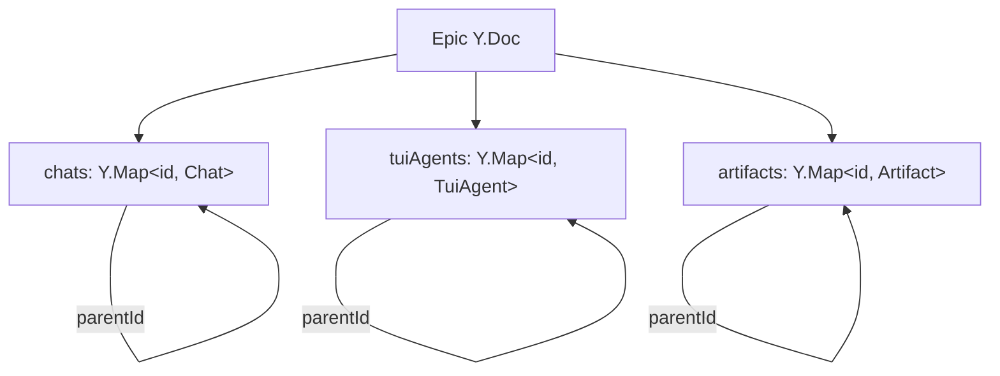

# Deep dive: agent-to-agent messaging

<user_quoted_section>Re-verified against ad605aa9 (2026-08-14). Original analysis ran against e372e303, 297 commits behind. Every "steal this" design below survived verification unchanged — canParticipateInA2A, the responseId thread semantics, the seven-reason notice taxonomy, ProfileSelection, and the parentId hierarchy are all byte-identical. Amendments: agent.fork@1.0 now has a real contract (my "protocol lags product" finding is fixed); four new A2A surfaces landed; cross-host delivery still rejects. See §15.</user_quoted_section>

The feature we most want to learn from. This is my exhaustive reconstruction from the wire contract, message formatters, CLI client, renderer, and the live MCP tool surface.

<user_quoted_section>Evidence boundary. The broker itself lives in the closed-source host. Everything below marked [contract] is read directly from protocol/src; everything marked [documented] comes from protocol doc-comments describing host behavior; everything marked [observed] comes from the live MCP server this session is connected to. Nothing is guessed.</user_quoted_section>

## 0. The one-paragraph version

Agents in an Epic address each other by id through a host-local **broker**. A send is fire-and-forget; a _reply-expected_ send mints a **thread id** (`responseId`) that the receiver must echo to close the thread. The broker tracks open threads and — this is the part everyone else misses — **actively notifies the sender when the counterparty goes silent, with a typed reason distinguishing "turn ended", "process exited", "user stopped it", "it errored", "it's blocked on a human", and "it was cancelled outright"**. Delivery reaches GUI agents natively through an MCP bridge and TUI agents through a background `traycer monitor` process wired to the harness's own lifecycle hooks.

## 1. The MCP surface _[observed]_

The host serves an MCP server named **`traycer_a2a`**, injected into every agent's tool namespace. 17 tools:

### Messaging

| Tool                     | Purpose                                                                                                                                                                                                      |
| ------------------------ | ------------------------------------------------------------------------------------------------------------------------------------------------------------------------------------------------------------ |
| `traycer_send_message`   | Send to a peer. `{toAgentId, message, expectReply?, responseId?}`. Async — _"returns as soon as the message is queued, and any reply arrives later as a new incoming message, never as this tool's result."_ |
| `traycer_get_transcript` | Read another agent's conversation as an XML-tagged string.                                                                                                                                                   |
| `traycer_list_agents`    | Enumerate reachable agents; `scope: "user" \| "all"`.                                                                                                                                                        |
| `traycer_get_self`       | Authoritative "which agent am I".                                                                                                                                                                            |

### Lifecycle

| Tool                      | Purpose                                                                                                             |
| ------------------------- | ------------------------------------------------------------------------------------------------------------------- |
| `traycer_create_agent`    | Spawn a child agent (harness, model, effort, fast mode, profile, permission mode, workspace, surface).              |
| `traycer_configure_agent` | Atomically re-point an existing agent's harness/model/profile/effort/permission mode **from its next turn onward**. |
| `traycer_fork_agent`      | Fork an agent from its latest checkpoint into a new agent. **No protocol contract exists for this.**                |
| `traycer_archive_agent`   | Retire an agent. **No protocol contract exists for this.**                                                          |
| `traycer_stop_agent`      | Stop a running agent, optionally cascading to descendants, optionally archiving.                                    |

### Environment

`traycer_create_worktree`, `traycer_list_epic_workspaces`, `traycer_agent_selection_guide`, `traycer_list_harness_models`, `traycer_list_provider_profiles`, `traycer_get_provider_profile_rate_limits`, `traycer_list_comment_threads`, `traycer_set_comment_thread_status`.

**Finding:** `fork` and `archive` have no counterpart anywhere in `protocol/src` (verified by grep for `agent.fork`, `agent.archive`, `forkAgent`, `archiveAgent` — zero hits). The OSS protocol snapshot is behind the shipped host.

## 2. Who may participate

Single source of truth, `protocol/src/host/agent/shared.ts:190` _[contract]_:

```ts
export function canParticipateInA2A(target: {
  readonly surface: "gui" | "tui";
  readonly harnessId: string | null;
}): boolean {
  if (target.surface === "gui") return true;
  return target.harnessId === "claude";
}
```

Every GUI agent participates (A2A is provider-native via the MCP bridge). Among TUI agents **only Claude Code** does, because it is the only one with a monitor-backed inbox and reply path. Codex/OpenCode/Cursor TUI agents have no inbox transport — they are discoverable and their transcripts readable, but they cannot send or receive.

The doc-comment is careful to add that this is _purely_ the A2A gate and deliberately **not** the gate for activity tracking: every agent, including non-participating TUI ones, still contributes activity to the awareness signal. Good separation.

## 3. Addressing and discovery — `agent.list@1.0` _[contract]_

Returns a flat array (not a keyed map — deliberately, to match the rest of the `list*` family). Per row:

```ts
{
  id, parentId, hostId, isLocal, surface: "gui"|"tui", harnessId, isSelf,
  title,                       // from the Y.Doc → populated even cross-host
  capabilities: { readTranscript: boolean, sendMessage: boolean },
  active,                      // genuinely executing right now
  folderPaths: string[],       // where it actually works
  isWorktree: boolean,
}
```

Three details worth stealing:

- **Per-row capability booleans.** The caller is told what it may do with each peer rather than discovering it by failing. The README's phrasing matches: _"Every agent can be referenced; reading a transcript and delivering a message are narrower."_
- **`active` is precisely defined and precisely narrow.** Sourced from the activity tracker's `hasActivity`, and the doc-comment explicitly states _"NOT effective-active: an agent merely owing an A2A reply is not 'working'."_ That distinction prevents a whole class of deadlock-detection bugs.
- **Locality is explicit.** `isLocal` means "this responding host minted the session". Cross-host rows are returned for **read-only enumeration**, but `agent.sendMessage` rejects them with `RECEIVER_NOT_LOCAL`. The Y.Doc replicates agent _records_ cross-host; the message _transport_ does not. They shipped the honest partial version rather than faking it.

## 4. Sending — `agent.sendMessage@1.0` _[contract]_

```ts
request:  { senderAgentId, epicId, receiverAgentId, prompt,
            responseId: string | null, expectReply: boolean }
response: { responseId: string | null }
```

Deliberately distinct from `chat.subscribe`'s `send`: that streams a turn back to a UI client, this _hands a prompt to another agent's runtime and returns immediately_.

The three-state semantics of the `(expectReply, responseId)` pair:

| `expectReply` | `responseId` | Meaning                                                                                          |
| ------------- | ------------ | ------------------------------------------------------------------------------------------------ |
| `true`        | `null`       | Open a thread. Broker mints and returns a `responseId`. **Idempotent per sender→receiver pair.** |
| `false`       | non-null     | **Close** the open thread named by that id — this is the reply.                                  |
| `false`       | `null`       | One-shot delivery, uncorrelated.                                                                 |

That `expectReply=true` is _idempotent per sender→receiver pair_ is the subtle bit: an agent that asks the same peer twice joins its existing thread instead of opening a second one. The MCP tool description confirms the intent — _"Repeat expectReply sends to the same agent join its open thread (same response id) instead of opening parallel requests."_

## 5. The thread contract — the actual innovation

A `responseId` names **the sender's whole thread with that peer, not one message**. The prompt injected into a receiving agent says so explicitly (`protocol/src/agent/a2a-message-format.ts:41`):

<user_quoted_section>"The responseId names this sender's thread, not this single message: follow-up messages may arrive with the same responseId, and one reply with it answers everything on the thread. Only a reply carrying the responseId completes the request — a fresh message does not."</user_quoted_section>

This is a genuinely good piece of protocol design _expressed as prompt text_. It preempts the two failure modes LLM agents actually exhibit: replying to each message separately (thread never closes, N notices fire), and replying with a fresh message that doesn't carry the id (sender waits forever).

### Message envelope rendering

One formatter, two channel-specific renderings (`formatAgentMessage`), so wording can never drift between surfaces.

**GUI** — injected as a user-turn prompt:

```
[traycer:agent-message] from <Title> (agent <id>) [claude]
[traycer:agent-message] A reply is expected. Use the traycer_send_message tool to reply with responseId="…".
[traycer:agent-message] The responseId names this sender's thread, not this single message: …

<body>
```

**CLI/TUI** — includes the literal command to run, plus truncation-recovery guidance:

```
[traycer inbox] message from <Title> (agent <id>) [claude] — responseId <id>
[traycer inbox] a reply is expected — reply with: traycer agent send --to <id> --response-id <id> --message "<your reply>"
…
[traycer inbox] ─── end of message ───
[traycer inbox] if the message above looks cut off, read it in full with: traycer agent inbox
```

Sender label degrades cleanly: `title` → falls back to bare id; harness suffix omitted when null.

## 6. Delivery: two transports

### GUI agents — MCP bridge, no broker inbox

Native provider tool call. The message becomes a turn on the receiving chat. _[documented]_ The inbox contract notes GUI agents _"have no truncation problem and never route through the broker inbox."_

### TUI agents — broker inbox + `traycer monitor`

`agent.inbox.subscribe@1.0` is a **streaming** RPC consumed by a background `traycer monitor` process spawned inside the Claude Code TUI session. Documented delivery model _[documented]_:

1. `agent.sendMessage` enqueues a `MailboxEnvelope` on the broker's **per-receiver inbox queue (RAM-only)**.
2. Each enqueue fires `onInboxChange`; the stream resolver drains and pushes each envelope as a `message` frame.
3. **If no monitor is subscribed, messages queue and the resolver replays the backlog on open.**
4. An inactivity sweep is the safety net.

Two design points worth noting:

- **Monitor presence is the authoritative reachability signal.** The resolver registers/unregisters the agent with the host's `AgentActivityTracker` on stream open/close, explicitly _"replacing the older PTY-data heuristic from `TerminalSessionManager`"_. They moved from inferring liveness from terminal output to an explicit protocol signal — the right call.
- **`agent.inbox.read@1.0` exists purely as a truncation-recovery path.** The monitor surfaces messages through a harness _background-output notification_, which the harness truncates. So there is a unary read returning the broker's retained ring (full bodies, oldest first) reachable via `traycer agent inbox`, whose stdout isn't capped. This is a real-world integration wart handled explicitly rather than ignored.

### TUI lifecycle via harness hooks

The CLI ships hook-driven commands that let the broker observe a TUI agent's lifecycle without parsing the PTY:

`agent-turn-ended-from-hook` · `agent-activity-from-hook` · `agent-session-observed-from-hook` · `agent-title-from-hook`

These map to `agent.tui.turnEnded`, `agent.tui.recordActivity`, `agent.tui.generateTitle`. Wired to Claude Code's Stop hook and friends. **This is how the broker knows a turn ended without a reply** — the `turn-ended` notice below is hook-sourced, which is why it's classified as the accurate primary signal.

Ambient context is passed by environment: `TRAYCER_AGENT_ID`, `TRAYCER_EPIC_ID` (plus `TRAYCER_AGENT_CLI_SURFACE`, `TRAYCER_HOME`). A Traycer-launched session therefore runs `traycer agent send --to …` with no other flags. `read*` variants return `null` for hook commands where missing context is a benign no-op; `resolve*` variants throw. Small, clean distinction.

## 7. Stalled-counterparty notices — the best idea in the feature

When a sender has an open `expectReply` thread and the receiver goes quiet, the broker pushes an **`inactivity` notice** (`agentInboxNoticeSchema`) — a distinct frame kind so _"the agent sees a clearly-marked system signal rather than something that looks like a peer message."_

```ts
{
  kind: "inactivity",
  senderAgentId, responseId, receiverAgentId,
  receiverTitle, receiverHarnessId, epicId,
  reason: "turn-ended" | "exited" | "quiet" | "user-stopped"
        | "errored" | "awaiting-input" | "receiver-cancelled",
  detail: string | null,
  droppedReceivers: Array<{receiverAgentId, responseId}> | null,
  noticedAt: number,
}
```

The seven reasons, with the doc's own trust annotations _[contract]_:

| Reason               | Meaning                                                                 | Trust                                                                      |
| -------------------- | ----------------------------------------------------------------------- | -------------------------------------------------------------------------- |
| `turn-ended`         | Receiver's turn ended (Stop hook) with no reply                         | **Accurate, primary signal**                                               |
| `exited`             | Receiver's process exited without replying                              | Definitive for this run                                                    |
| `quiet`              | Watchdog backstop: long PTY silence                                     | **Advisory** — may still be mid-turn; check its transcript                 |
| `user-stopped`       | User stopped the turn; will not resume on its own                       | Thread stays open                                                          |
| `errored`            | Turn ended on an error (e.g. rate limit); raw text in `detail`          | —                                                                          |
| `awaiting-input`     | Mid-turn but **blocked on a human** (asked a question / wants approval) | Won't reply until a person responds                                        |
| `receiver-cancelled` | Agent stopped outright; message **dropped undelivered**, thread closed  | _"Informational only: the sender must not re-send or spawn a replacement"_ |

Why this matters more than it looks:

1. **It distinguishes "not done yet" from "never coming".** `quiet` is explicitly advisory; `turn-ended` is authoritative. Most multi-agent systems have one undifferentiated timeout and therefore cannot tell an agent whether to keep waiting.
2. **`awaiting-input` breaks the classic deadlock.** Agent A waits on B; B is waiting on a human. Without this signal A waits forever. With it, A knows to escalate to the user instead.
3. **The notice carries instructions, not just data.** `receiver-cancelled` explicitly tells the sender _not_ to retry or spawn a replacement, and contrasts itself with `user-stopped` where the thread stays open. It's teaching the LLM the correct recovery behavior at the moment of failure.
4. **`droppedReceivers` batches.** One `agent.stop` cascade that kills three agents a sender was waiting on produces **one** notice listing all three, not three notices. `receiverAgentId`/`responseId` mirror the first entry for schema uniformity.

This is the design I would most want to reproduce.

## 8. Spawning children — `agent.create` v1 → v2 → v3 _[contract]_

```ts
{
  senderAgentId, epicId, name,
  surface: "gui"|"tui"|null,        // null → infer
  harnessId: AgentFacingHarnessId|null,
  model, agentMode, reasoningEffort, fastMode,   // nullable overrides
  workspace: { entries: [{path, workspacePath}] } | null,
  profileSelection,                  // v2
  permissionMode,                    // v3
}
→ { agentId, warnings: string[] }
```

Inheritance ladder: both `surface` and `harnessId` null → inherit sender's; `harnessId` set, `surface` null → infer surface; both set → use as given.

**`warnings: string[]` instead of rejection.** Unsupported combinations fill defaults and warn rather than failing the whole create. Right call for an LLM caller that will confidently request a nonexistent effort level.

`parentId` is set to `senderAgentId` at creation so lineage renders without a join.

### Profile selection — the design to steal

`agent.create@1.0` had `profileId: string | null`, where `null` meant "inherit sender". That conflates three different intents. v2.0 replaced it with a discriminated union and — notably — shipped a **new major** specifically to _remove_ a field:

```ts
type ProfileSelection =
  | { kind: "last_used" } // resolve caller's per-user/per-provider last-used
  | { kind: "ambient" } // explicitly the provider's ambient CLI login
  | { kind: "profile"; profileId } // pin a managed profile
  | { kind: "inherit_sender" }; // bridge-only: what v1.0's null upgrades to
```

Guardrails that make it airtight:

- `AMBIENT_PROFILE_ID_SENTINEL = "ambient"` is **refused** as a managed `profileId` via a Zod `.refine()`, so the two arms can never claim the same identity through disagreeing shapes.
- `inherit_sender` is **bridge-only** — never offered by any new discovery, rate-limit, configuration, tool, or CLI contract.
- `last_used` and `ambient` have **no v1.0-representable value**, so they can never downgrade to `agent.create@1.0`.
- A separate `ConcreteProfileSelection` (just `ambient | profile`) is used everywhere a caller must name a _resolvable_ profile — excluding `last_used` (a preference lookup, not a selection) and `inherit_sender`.

Two union types for two different questions ("what do you want?" vs "which one, concretely?") is exactly right.

### Privacy guardrail

`agentProviderProfileSummarySchema` is _"deliberately narrow — a projection of `ProviderProfile`, not a reuse of its wire type — so email, account UUID, tier identity, config paths, environment overrides, CLI candidates, and credential-derived labels never reach an agent."_ An explicit, documented data-minimization boundary between host state and agent-visible state. We need this from day one.

## 9. Reconfiguring — `agent.configure@1.0/2.0` _[contract]_

Atomically switches harness/model/profile/effort/fast-mode/permission-mode for an existing GUI agent, **effective from its next turn**. The in-progress turn and anything already queued keep the settings they started with; nothing is interrupted or re-run.

Semantics _[observed, from the tool description]_:

- Workspace rebind is **refused while a turn is running** — the caller is told to use `fork` into the new worktree instead.
- Terminal agents cannot be reconfigured in place.
- Response echoes the full resolved settings tuple plus `warnings`.

Note the `configure` vs `fork` split: _change this agent going forward_ vs _branch it_. Because `configure` refuses mid-turn workspace changes and points at `fork`, the two compose into a complete story with no invalid intermediate state.

## 10. Stopping — `agent.stop@1.0` _[contract]_

```ts
{ epicId, agentId, cascade: boolean } → { stoppedAgentIds: string[] }
```

- `cascade=false` → GUI: abort the current turn. TUI: SIGINT the CLI **while keeping the PTY and tab alive** so navigating back re-attaches/respawns.
- `cascade=true` → resolver walks `parentId` descendants and stops the active ones.

Design notes:

- **`surface` is deliberately absent.** The resolver reads it from storage to choose turn-abort vs SIGINT. Only `agent.create` carries `surface`, because no record exists yet. Consistent addressing rule across the whole family.
- **Fan-out is the resolver's job, not the caller's** — the caller names one agent; the response reports the set actually stopped.
- **Stopping is not terminal.** _"In-flight broker traffic is purged under a transient cancel-guard so the subtree can't revive itself, but a later message wakes any of these agents normally."_ The cancel-guard preventing self-revival during a cascade is a detail you only get right after being bitten.

The live tool surface adds richer reporting _[observed]_: `stoppedAgentIds`, `archivedAgentIds`, `notArchivedAgentIds`, `skippedAgentIds` (other user / other host), `failedAgentIds` (teardown threw — _"treat those as unfinished rather than idle"_). It also documents that a terminal agent's CLI interrupt is **advisory**, so its stop can't be confirmed and it's never archived in the same call. Honest about what it cannot guarantee.

## 11. Hierarchy storage

Lineage is a single nullable `parentId` on the agent record — in `chatSchema` for GUI agents and `tuiAgentSchema` for TUI agents, both inside the Epic root Y.Doc. Artifacts use the identical `parentId` pattern.



Consequences:

- Hierarchy **replicates cross-host and cross-device for free** — it's CRDT state, not broker state. `agent.list` returns titles for cross-host rows precisely because they come from the Y.Doc.
- The broker holds only _ephemeral_ state (RAM-only inbox queues, open threads, sweep timers). Durable structure lives in the doc. Clean split: **the broker owns delivery, the doc owns identity.**
- But: GUI and TUI agents live in **two parallel maps** with two parallel `parentId` graphs. A mixed-surface tree requires walking both. This is why `agent.list` flattens them into one array with a `surface` discriminator — the unification happens at the RPC layer rather than in storage. If I were designing this fresh I would use one `agents` map with a `surface` field.

## 12. Cross-host reality check

| Capability                            | Same host | Cross host                                       |
| ------------------------------------- | --------- | ------------------------------------------------ |
| Appear in `agent.list`                | ✅        | ✅ (from Y.Doc)                                  |
| Title / lineage visible               | ✅        | ✅                                               |
| `folderPaths`, `active`, `isWorktree` | ✅        | ❌ (local-only, empty/false)                     |
| `agent.sendMessage`                   | ✅        | ❌ `RECEIVER_NOT_LOCAL`                          |
| `agent.getTranscript`                 | ✅        | TUI: ❌ (host-local session store + credentials) |
| `agent.stop`                          | ✅        | ❌ (own host only)                               |

The doc-comment names the reason plainly: _"the epic Y.Doc already replicates artifact records cross-host, but the message-delivery transport does not."_ A relay/mailbox transport is anticipated but unbuilt.

## 13. What to steal, concretely

1. **Typed silence with trust levels.** The seven-reason notice taxonomy, the advisory-vs-authoritative annotation, and `awaiting-input` as a first-class deadlock breaker. Highest-value idea in the product.
2. **Thread-scoped `responseId` with idempotent open**, and the explicit prompt text teaching the model that the id names a thread. Protocol correctness delivered through prompt design.
3. **Per-row `capabilities` in discovery.** Tell the caller what it may do instead of making it discover by failure.
4. **`warnings[]` on create instead of rejection.** LLM callers request impossible configurations constantly; degrade and report.
5. **Discriminated-union selection over nullable ids** (`ProfileSelection` / `ConcreteProfileSelection`), including shipping a major version purely to delete an ambiguous field.
6. **A documented agent-visible data-minimization boundary** — a narrow projection type, not a reuse of the internal one.
7. **Broker owns delivery, CRDT owns identity.** Ephemeral routing state separate from durable hierarchy.
8. **Lifecycle via harness hooks, not output parsing.** Stop-hook-driven `turn-ended` is why the primary signal is trustworthy.
9. **Stop is not terminal, with a cancel-guard.** Stopped agents wake on the next message; a transient guard stops a cascading subtree reviving itself.
10. **One formatter, per-channel renderings**, so GUI and CLI wording cannot drift.

## 14. What to do differently

1. **One `agents` map, not two.** Unify GUI/TUI at the storage layer with a `surface` discriminator.
2. **Design cross-host delivery in from the start.** The Y.Doc already replicates identity; not having a relay makes multi-machine fleets — our headline feature — a dead end. This is the single biggest gap.
3. **Don't rely on an out-of-band background process for inbox delivery.** The `traycer monitor` + truncation + `agent.inbox.read` recovery chain is three mechanisms compensating for one integration constraint.
4. **Make thread state durable and inspectable.** RAM-only queues mean a host restart silently drops in-flight threads. Persist open threads; give the user a UI for "who is waiting on whom".
5. **Ship `fork`/`archive` as versioned contracts**, not tools that outran the protocol.
6. **Add explicit deadlock/cycle detection.** The notice system detects _silence_, not _cycles_. A→B→A with both expecting replies is not caught.

## 15. Delta: what changed by `ad605aa9` (2026-08-14)

### Verified unchanged

`canParticipateInA2A` (GUI + Claude TUI only), the `(expectReply, responseId)` three-state semantics, the thread-not-message prompt text, the seven-reason `agentInboxNoticeSchema` with its trust annotations, `ProfileSelection` / `ConcreteProfileSelection` and their guardrails, `agent.create` warnings-not-rejection, `agent.stop` cascade + cancel-guard, and the `parentId` hierarchy in two parallel maps. **All ten "steal this" items stand.**

### Fixed: `agent.fork` is now a real contract

`feat(protocol,cli): add agent.fork@1.0 and traycer agent fork (#1077)` and `feat(cli): add traycer agent stop and traycer agent archive (#1076)`. `"agent.fork"` is now in `protocol/src/host/registry.ts:5089`, with `agent.tui.validateForkProfile` supporting fork-style TUI profile switching (#859). **My "the shipped MCP surface is ahead of the published protocol" finding no longer applies to fork.** Archive still has no `agent.*` RPC — it is modeled as chat state via `epic.setChatArchived`, which is arguably the more correct decomposition (archiving is a property of the record, not an operation on the runtime).

### New: agent role claims — a coordination primitive we should copy

`agent.roles.claim` / `agent.roles.list` / `agent.roles.relinquish`, persisted in the epic record as `roleClaims`:

```ts
roleClaimSchema = { claimId: uuid, agentId, userId, role, scope, claimedAt };
```

Purpose, from the schema: _"Agents self-designate a role over a Task-local scope so peers can avoid duplicating responsibility; unrelated to the collaborator ACL."_

Two details worth stealing:

- **`roleClaimIdentityKey`** normalizes case and whitespace so `Planner` and `planner` are the same claim and near-duplicates get caught — _"derived on demand and never persisted, so it cannot drift from the stored text."_ It also explicitly documents that this is `toLowerCase()`, **not** Unicode casefolding, and claims no casefold semantics. That kind of precision about what a normalization does _not_ guarantee is rare.
- The map key **is** the `claimId`, enforced by a Zod `.refine()` — _"a key/value mismatch [is] a parse error instead of a silently-valid malformed record."_

This directly addresses the "two agents both decide they're the reviewer" failure mode, which is a real problem for fleets. **Add to the steal list.**

### New: the Epic Communication Graph — A2A observability

`epic.communicationGraph.subscribe@1.0` (#809) backs a Communication Graph tile: **agent nodes, A2A edges, and a playback timeline** over a per-epic communication event log. Its delivery contract is unusually rigorous:

<user_quoted_section>"Rows are delivered strictly id-ASCENDING per subscription, across both frame kinds… Delivery is EXACTLY-ONCE and GAP-FREE relative to the client's cursor, for every WIRE-REPRESENTABLE row."
"snapshot is a transport batching optimization, NOT a claim that the backlog is complete, so a client that treats 'snapshot ended' as 'caught up to now' is relying on something the host never promised."</user_quoted_section>

Plus a deliberate **representability exception**: a stored row whose `kind` the serving host cannot represent in this contract version is skipped and the cursor advances past it — stated explicitly rather than left as an accident.

**This is the single most valuable _new_ idea in the delta for our product.** A fleet manager needs to answer "who asked whom what, and when did it stall" — and Traycer built it as a first-class, cursor-based, exactly-once event log with playback rather than as log scraping. Steal the shape _and_ the honesty about what `snapshot` does not promise.

### New: `agent.inbox.ack` and `agent.activity.subscribe`

- **`agent.inbox.ack`** — explicit inbox acknowledgement, closing the loop the original fire-and-forget-plus-sweep model left open. Delivery is now acknowledged rather than only inferred from activity.
- **`agent.activity.subscribe`** (`feat(protocol): add host-local agent activity stream (#883)`) — a host-local streaming activity feed, replacing polling for "is this agent working".
- **`feat: unify monitors and shells into notifying shells (#1065)`** and `feat(protocol,gui-app): managed-command Monitors & Shells — delivery chips (#855)` reworked the `traycer monitor` mechanism I described in §6 into a general managed-command surface with delivery chips. The truncation-recovery chain (`agent.inbox.read`) still exists, but the transport around it is now a unified notifying-shell abstraction.
- **`feat(protocol,traycer-cli): frozen-prompt contract and promptSubmitted hook pull (#1063)`** adds `agent.tui.promptSubmitted` — another harness-hook lifecycle signal, reinforcing the "lifecycle via hooks, not output parsing" pattern.
- **`feat(protocol,gui-app,traycer-cli): read-only terminal access for agents (#997)`** — agents can now read terminal output, a new cross-surface capability.
- **`feat(agent): expose the resolved run config on agent list rows (#1081)`** — `agent.list` rows now carry the resolved run configuration, so a peer can see exactly how another agent is configured without a second call. Consistent with the existing per-row `capabilities` design.

### Unchanged and still the biggest gap: cross-host delivery

`RECEIVER_NOT_LOCAL` is still in `protocol/src/host/agent/shared.ts` with the same rationale. This is notable **because remote-host support landed in the same window** (#188, #1133): there is now a full Noise-encrypted multiplexed remote transport, remote repo resolution, remote folder picking, and remote lifecycle — but **A2A message delivery still does not cross hosts.** Agent identity replicates (Y.Doc), agents on remote hosts are now reachable for RPC, and messaging still refuses.

For a product whose headline is multi-machine agent fleets, this remains the #1 thing to design in from the start rather than bolt on. Traycer built the transport and did not route A2A over it.
