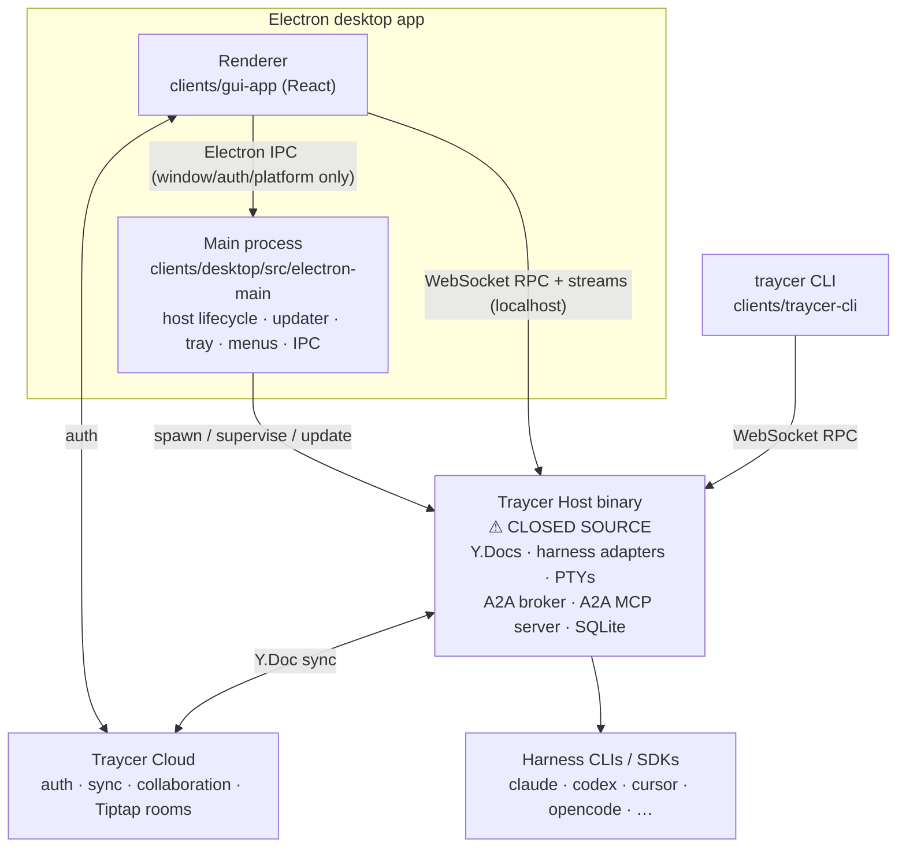

# Traycer research

Source: `traycerai/traycer` @ **`ad605aa9` (2026-08-14)**. 703 commits, first commit **2026-06-22** — the open-source repo is under two months old and moving extremely fast.

<user_quoted_section>Provenance note. The original research ran against e372e303 (2026-07-23), which was 297 commits behind. Every section has been re-verified against ad605aa9 and amended in place; the deep-dive sub-artifacts carry their own verification banners and delta sections. Where a finding changed, the change is called out rather than silently overwritten.
Velocity context: 297 commits in three weeks — the repo nearly doubled in size (406 → 703 commits) during the window. Any snapshot of this codebase ages fast; treat findings as dated.</user_quoted_section>

## Read this first — three framing facts

**1. The most important component is not in this repo.** The repo ships the _clients_ only: protocol contract, CLI, GUI renderer, Electron shell. The **Traycer Host** — which owns the Y.Docs, drives every harness CLI/SDK, runs the PTYs, runs the **A2A broker**, and serves the **A2A MCP server** — is a signed binary downloaded from GitHub Releases and is closed-source. `docs/DEVELOPMENT.md` is explicit: _"Releases are built and signed in Traycer's internal repository."_

So for the A2A deep dive, what we can read is the **wire contract, the message formats, the CLI client, and the renderer**. The broker's queueing, sweep, and routing internals are inferred from unusually detailed protocol doc-comments (which are excellent — `protocol/src/host/agent/inbox.ts` documents the broker's delivery model in prose). Treat broker internals as _specified_ rather than _verified_.

**2. ~~The OSS protocol lags the shipped product.~~ — CORRECTED at `ad605aa9`.** This was true at `e372e303` but has since been fixed: `agent.fork@1.0` shipped in #1077 and is now in the registry. Archive is modeled as chat state (`epic.setChatArchived`) rather than an agent RPC, which is the better decomposition. **The protocol has caught up.** What remains true is the _velocity_ observation: the published contract can trail the shipped binary by weeks, so a snapshot-based read of this repo will mis-state the product.

**3. The perf problems are not naïveté.** This codebase is _aggressively_ optimized — virtualized chat, a global rAF flush coordinator, a Y.Doc patch projector that guarantees one render per transaction, `content-visibility` tricks during panel drags, a shipped Long-Tasks probe. The freezes come from **architectural decisions**, not sloppy React. That distinction is the single most useful thing this research produces, and it is why the deep dive is worth reading in full.

## Deep dives (sub-artifacts)

| Artifact                                               | Covers                                                                                                                                                   |
| ------------------------------------------------------ | -------------------------------------------------------------------------------------------------------------------------------------------------------- |
| [`agent-to-agent/`](./agent-to-agent/index.md)         | The peer-messaging system end to end: MCP surface, broker model, `expectReply` threads, lifecycle notices, create/configure/fork/stop, hierarchy storage |
| [`organization-model/`](./organization-model/index.md) | Epics as containers, the artifact model, multi-workspace binding, worktree lifecycle, persistence                                                        |
| [`performance/`](./performance/index.md)               | Root-cause analysis of freezes, thread-jumping, large-thread degradation                                                                                 |

## 1. Feature inventory

### Organization & workspace

| Feature                     | How it works                                                                                                                                                                                                                                                                                                                                                    |
| --------------------------- | --------------------------------------------------------------------------------------------------------------------------------------------------------------------------------------------------------------------------------------------------------------------------------------------------------------------------------------------------------------- |
| **Epics**                   | The top-level container. One Epic = one root Y.Doc holding artifact metadata, chats, and terminal-agent records, plus N workspace folders, N agents, N terminals. Regular mode is quick one-off tasks; Epic mode is the structured multi-step workflow.                                                                                                         |
| **Epic canvas / tiles**     | Each Epic tab is a splittable pane tree. Tile kinds: `chat`, `terminal-agent`, `terminal`, `spec`, `ticket`, `story`, `review`, `workspace-file`, `git-diff`, `snapshot-diff`, `blank` (`stores/epics/canvas/tile-kinds.ts`). Panes split right/bottom, tiles dedup on open, tabs persist per Epic.                                                             |
| **Artifacts**               | Markdown docs in four kinds — `spec`, `ticket`, `story`, `review` — arranged in a tree via `parentId`. Tickets/stories carry an integer `status`. Bodies are `Y.XmlFragment`s living in **separate per-artifact "artifact rooms"**, referenced by `artifactRoomId`; only metadata sits in the root doc. Edited collaboratively in a TipTap editor bound to Yjs. |
| **Multi-folder workspaces** | An Epic binds several workspace folders at once, each resolvable to a git repo identifier. `workspace.prepareFolders`, `workspace.resolvePathsByRepoIdentifiers`, and a host-local `repoMapping` translate cloud repo identity → on-disk checkout, so collaborators on different machines resolve the same Epic to their own paths.                             |
| **Worktrees**               | Per-agent git worktree provisioning. A binding is a list of entries, each independently `local` or `worktree` mode, with setup-script state (`pending`/`running`/`succeeded`/`failed`/`cancelled`), owned submodule branches, and PR state. Full manager UI in Settings → Worktrees with pagination, filters, and bulk delete.                                  |
| **Comment threads**         | Anchored comments on artifact text. Each thread reports `anchorStatus` (`present`/`missing`/`unavailable`) so a quote whose text moved is shown as context-only rather than silently mis-anchored. Threads ride the Y.Doc update channel, not a typed frame.                                                                                                    |
| **Collaboration**           | Cloud-synced Epics with collaborator roles, `epic.grantAccess`/`revokeCollaborator`/`batchUpdateRoles`, real-time co-editing via Yjs awareness (cursors, presence), and cross-device sync.                                                                                                                                                                      |
| **Checkpoints / rewind**    | Every turn writes a checkpoint manifest of file operations (`edit`/`create`/`delete`). Entries touching an artifact's `index.md` are tagged so the UI shows a titled artifact row instead of a raw path. Supports per-turn and bulk revert, plus `snapshots.readSnapshotDiff` for a diff tile.                                                                  |

### Agents

| Feature                               | How it works                                                                                                                                                                                                                                                                                                                                                                       |
| ------------------------------------- | ---------------------------------------------------------------------------------------------------------------------------------------------------------------------------------------------------------------------------------------------------------------------------------------------------------------------------------------------------------------------------------- |
| **Two agent surfaces**                | **GUI agents** render as a chat tile; the host drives the harness via SDK/JSON-RPC and streams `RuntimeEvent` chunks over `chat.subscribe`. **TUI agents** render as a real terminal tile; the host only _prepares a launch_ (cwd, extra dirs, session id, argv) and the CLI runs interactively in a PTY.                                                                          |
| **Harness selection**                 | 17 GUI harnesses: claude, codex, opencode, traycer, cursor, grok, qwen, kiro, droid, kimi, copilot, kilocode, openrouter, amp, devin, pi, hermes. Only 4 TUI harnesses (claude, codex, opencode + cursor as a _reserved compatibility value_ that is rejected at creation).                                                                                                        |
| **Model / effort / fast mode**        | Per-chat run settings tuple: `{harnessId, model, permissionMode, reasoningEffort, serviceTier, agentMode, profileId}`. Model catalogs come from `agent.gui.listModels` / `agent.listHarnessModels`; each model advertises its own `reasoningEfforts[]` and `fastModeAvailable`.                                                                                                    |
| **Provider profiles**                 | Multiple logged-in subscriptions per provider. A profile is either the provider's **ambient CLI login** or a Traycer-**managed** profile. Selection is a discriminated union (`last_used` / `ambient` / `profile` / `inherit_sender`) rather than a nullable id — see the A2A deep dive; this is one of the best designs in the codebase.                                          |
| **Rate limits**                       | Per-profile rate-limit status, cached summaries in list responses plus on-demand detailed reads. Drives a header popover, a "switch profile" recommendation banner, and a queue provider that backs off when a profile is exhausted.                                                                                                                                               |
| **Unified context / model switching** | Switching harness or model mid-agent preserves the conversation — the context window is shared across providers. Changing the model is only expressible as a **whole-tuple replace**, never a partial patch, because a new model invalidates the reasoning/tier selection.                                                                                                         |
| **Permission modes**                  | `supervised`, `auto_accept_edits`, `full_access`, ordered most- to least-restrictive from a single source of truth reused by the RPC schema default, the adapter declarations, and the renderer's safest-fallback clamp.                                                                                                                                                           |
| **Agent Selection Guide**             | Layered markdown instructions telling an orchestrating agent which child agents to spawn for which task. Resolved from `~/.traycer/…` (global) plus per-workspace `.traycer/agent-selection-guide.md`, merged by explicit numeric `priority` with a rendered precedence preamble. Editable in Settings → Agents and seeded during onboarding from the user's configured providers. |
| **Skills**                            | Skills are vendored from an "autoskills registry" and pinned by content hash in `skills-lock.json` (sources include `anthropics/skills`, `vercel-labs/agent-skills`, `shadcn/ui`). Surfaced to the user through a `$`-triggered multi-skill composer picker.                                                                                                                       |
| **Subagents & background items**      | Nested subagent runs render as collapsible cards inside a turn; background work (backgrounded Bash, subagents, MCP calls, Monitor) is tracked as `BackgroundItem`s that can outlive the turn.                                                                                                                                                                                      |
| **Interviews / approvals**            | The host can pause a turn to ask a structured question (`pendingInterviews`, with per-chat persisted answer drafts) or request tool/file-edit approval (`pendingApprovals`, `pendingFileEditApprovals`).                                                                                                                                                                           |

### Chat & editing

| Feature                  | How it works                                                                                                                                                                                                                                                                |
| ------------------------ | --------------------------------------------------------------------------------------------------------------------------------------------------------------------------------------------------------------------------------------------------------------------------- |
| **Composer**             | TipTap-based rich composer with `@` mentions resolving files, folders, git branches, commits, worktrees, epics, specs, tickets, stories, reviews, and **agents**; `$` skill picker; image paste/drop with hash validation; pasted files inserted as paths; per-chat drafts. |
| **Message queueing**     | Messages sent during a running turn are queued host-side with optimistic local echo and a reconciler that merges the authoritative queue against in-flight optimistic items.                                                                                                |
| **Steering**             | Mid-turn user messages are nested into the active turn as steer badges rather than appearing as separate rows.                                                                                                                                                              |
| **Quote-to-composer**    | Selecting transcript text surfaces a floating quote button that appends the selection to the composer as a blockquote.                                                                                                                                                      |
| **User-message minimap** | A rail of user-message markers alongside the transcript with an active-position indicator, click to navigate.                                                                                                                                                               |
| **Find in chat**         | Per-tile find controller with match reveal, forced-open of collapsed groups, and scroll reconciliation.                                                                                                                                                                     |
| **Markdown rendering**   | react-markdown + remark-gfm + rehype-sanitize, Shiki highlighting (19 lazily-imported grammars, throttled during streaming, cached), Mermaid diagrams, and custom `traycer:` reference chips linking to artifacts/agents.                                                   |
| **A2A message cards**    | Inbound/outbound peer messages render as distinct styled cards in the transcript with a copy button.                                                                                                                                                                        |

### Terminals & tooling

| Feature                 | How it works                                                                                                                                                                                                                                                                        |
| ----------------------- | ----------------------------------------------------------------------------------------------------------------------------------------------------------------------------------------------------------------------------------------------------------------------------------- |
| **Terminals**           | Full xterm.js terminals (WebGL/canvas addons, search, clipboard, web links) with ack-credit + binary framing on `terminal.subscribe`, theme-synced ANSI palettes driven from CSS custom properties, and a warm-session registry that keeps recently-closed terminals alive briefly. |
| **Git integration**     | Watcher-driven status refresh, submodule-aware diffs grouped by repo, changed-file lists, per-file diff tiles, and a bundled diff viewer.                                                                                                                                           |
| **Resource monitor**    | Live per-process CPU/memory for host-spawned agent processes via `resources.subscribe`, with kill.                                                                                                                                                                                  |
| **Notification center** | Kinds: `chat`, `epic`, `agent_stalled`, `workspace_operation_failed`, `approval`, `interview`. Supports read/unread, explicit dismiss for needs-attention items, indicator state, and **user-defined notification hooks** (shell commands run on events, testable from Settings).   |
| **Command palette**     | ⌘K with scopes, prefixes, pinning, and sub-pages. Rule: every palette-visible action delegates to a shared function in `lib/commands/actions/` so palette and manual UI stay in lockstep.                                                                                           |
| **Speech / dictation**  | `speech.dictate` streaming with a downloadable local model (`speech.ensureModel`).                                                                                                                                                                                                  |
| **Host management**     | Settings → Host: version status, staged updates with a two-lane controller, a "host doctor" diagnostic with issue cards and recurrence tracking, log level control, and service (launchd/systemd) registration.                                                                     |
| **Keybindings**         | Fully user-customizable, including a configurable and disableable global summon hotkey.                                                                                                                                                                                             |
| **Windows / tabs**      | Multiple OS windows, in-app back/forward navigation, pinned task history, tab duplication, open-in-background, open-in-new-window.                                                                                                                                                  |

### New features added between `e372e303` and `ad605aa9`

| Feature                                  | How it works                                                                                                                                                                                                                                                                                                                          |
| ---------------------------------------- | ------------------------------------------------------------------------------------------------------------------------------------------------------------------------------------------------------------------------------------------------------------------------------------------------------------------------------------- |
| **Remote hosts**                         | Full end-to-end remote-host support: a Noise-encrypted multiplexed relay transport (`host-transport/remote/`), remote switching, repo resolution, config/diagnostics, lifecycle, an Overview surface, and a remote folder picker over `workspace.browseFolders`. Host liveness moved to a hosts DTO, retiring the presence heartbeat. |
| **Epic Communication Graph**             | A per-epic A2A event log rendered as agent nodes + message edges with a **playback timeline**, over a cursor-based exactly-once, gap-free stream (`epic.communicationGraph.subscribe@1.0`). The observability layer for multi-agent work.                                                                                             |
| **Agent role claims**                    | Agents self-designate a `role` over a task-local `scope` (`agent.roles.claim`/`list`/`relinquish`) so peers avoid duplicating responsibility. Case/whitespace-normalized identity catches near-duplicates.                                                                                                                            |
| **Chat-sync v2 / chat sharing**          | Chats became host-authoritative with cloud backup, published as a mutable **head** plus immutable **content-addressed shards** (not Yjs). Adds per-chat cloud visibility controls, archiving with indicators/filters, retraction UX, a unified sidebar, and clone-carries-history.                                                    |
| **Usage analytics**                      | Optional `host.usage.summary` RPC feeding a usage dashboard — ECharts area chart, grouping by model, a by-chat table, and per-epic usage windows.                                                                                                                                                                                     |
| **MCP / plugins / skills settings**      | A real settings surface with capability-driven contracts, replacing the lock-file-plus-composer-picker-only model. Plugin rows carry artwork.                                                                                                                                                                                         |
| **Provider version management**          | Users pick, keep and pause provider CLI versions; a Model Providers wire contract + settings tab; a provider-pack registry; Copilot terminal sign-in; provider search and enabled/disabled filtering.                                                                                                                                 |
| **Read-only terminal access for agents** | Agents can read terminal output — a new cross-surface capability.                                                                                                                                                                                                                                                                     |
| **Managed Monitors & Shells**            | Monitors and shells unified into "notifying shells" — managed commands with delivery chips and durable background cards for backgrounded commands.                                                                                                                                                                                    |
| **Devices & Sessions**                   | A device/session management surface with a step-up OTP flow.                                                                                                                                                                                                                                                                          |
| **Chrome-style split tabs**              | Split tab view with drag-and-drop, plus dragging active agents directly into tiles.                                                                                                                                                                                                                                                   |
| **Epic PR View**                         | Per-epic pull-request view (shipped, reverted, restored with GitHub rate-limit fixes). PR/issue mentions in the composer.                                                                                                                                                                                                             |
| **Mid-turn steering + frozen prompts**   | Cmd+Enter mid-turn steering; a frozen-prompt contract with a `promptSubmitted` hook pull.                                                                                                                                                                                                                                             |
| **Harnesses 17 → 19**                    | Added `omp` (Oh My Pi) and `huggingface`.                                                                                                                                                                                                                                                                                             |
| **Composer/editor**                      | Fuzzy-ranked `@` mentions across kinds and a fuzzy slash-command menu; Slack-style code-fence input; inline image previews in workspace and git-diff tiles; safe in-place diff editing (Diffs 1.3.1); compact-conversation action on the context-usage chip.                                                                          |
| **Notifications**                        | Cloud notification feed over immutable entries; cloud-derived indicators with visit-to-clear; `context_exhausted` and `request_rejected` stopped reasons; task notification rollups.                                                                                                                                                  |

## 2. Architecture map

### Process model

Key point: the renderer talks to the host **directly over localhost WebSocket**, not through Electron IPC. Electron IPC is reserved for window state, auth token storage, platform services, and host management. So "chatty IPC" here means _chatty WebSocket_, which matters for the perf analysis.

### Repo layout

| Path                   | Package                        | Responsibility                                      | ~TS files |
| ---------------------- | ------------------------------ | --------------------------------------------------- | --------- |
| `protocol/`            | `@traycer/protocol`            | Versioned client⇄host wire contract                 | 245       |
| `clients/shared/`      | `@traycer-clients/shared`      | Transport (WS/RPC), auth (PKCE/bearer), host client | 96        |
| `clients/traycer-cli/` | `@traycer-clients/traycer-cli` | `traycer` CLI; provisions/verifies the host         | 241       |
| `clients/gui-app/`     | `@traycer-clients/gui-app`     | React renderer (**269k LOC** in `src/`)             | 2,364     |
| `clients/desktop/`     | `@traycer-clients/desktop`     | Electron shell (30k LOC)                            | 239       |

Bun workspaces + Nx for cached task orchestration. ESLint with custom rules, Vitest, pre-commit hygiene, DCO enforcement.

### Renderer stack

Vite · React (with **React Compiler** — there is a commit fixing a crash loop it caused) · TypeScript · TanStack Router (file-based) · TanStack Query (all backend calls) · Zustand (UI/client state) · Tailwind v4 · shadcn/ui · Yjs + TipTap · xterm.js · Virtuoso (`@virtuoso.dev/message-list`, licensed) · Shiki · Mermaid · CodeMirror.

The workspace `AGENTS.md` is unusually prescriptive and clearly enforced: every backend call must flow through TanStack Query; query keys live in a central `lib/query-keys/` barrel; error mapping has exactly one helper per source; mutations capture the active host id in `onMutate` to survive a host swap mid-flight. This is a codebase with real conventions, not aspirational ones.

### The protocol: per-method runtime version negotiation

This is the standout engineering in the repo. `@traycer/protocol` is **not** npm-semver-versioned. Every RPC method carries its own `{major, minor}`, and client and host negotiate **per method** at handshake time:

- Same major, client newer minor → wire at host's minor; request Zod-stripped down, response upgraded back up.
- Cross major → wire at host's canonical; request routed through an explicit `downgradeRequest` bridge, response through `upgradeResponse`.
- No bridge available → `DOWNGRADE_UNSUPPORTED` **before** the request is sent.

Released schema shapes are **frozen in code and never edited**. `agent.gui.listHarnesses` has literal frozen enums at v1.0/v2.0/v3.0/v4.0 capturing exactly which harnesses existed at each release, with bridges that _filter_ newer harnesses out for older clients. Downgrade bridges **fail closed** — e.g. a Hermes rate-limit read returns `DOWNGRADE_UNSUPPORTED` rather than mis-decoding. Tests pin the released method catalog and a "released floor" list element-for-element against fixtures.

**279 RPC methods** at `ad605aa9` (was ~130 at `e372e303` — the surface **more than doubled in three weeks**) across: `agent.*`, `chat.subscribe`, `epic.*`, `terminal.*`, `worktree.*`, `workspace.*`, `git.*`, `comments.*`, `providers.*`, `host.*`, `notifications.*`, `snapshots.*`, `resources.*`, `speech.*`, `editor.*`, `migration.*`.

That growth rate is itself a finding: a per-call manifest handshake that iterates the full catalog (see [performance](./performance/index.md) root cause #2) gets more expensive every week. The design does not degrade gracefully with surface growth.

### How it drives harnesses

Two fundamentally different paths, and the split is the right one:

- **GUI surface** — the host runs the vendor SDK in-process and normalizes everything into a `RuntimeEvent` stream (`protocol/src/host/agent/gui/agent-runtime.ts`, 1,156 lines; accumulator 1,803 lines). Token usage is adapter-normalized into a single canonical `contextTokens` numerator explicitly to avoid double-counting cache reads on OpenAI-style SDKs, and `contextWindow` is _always_ SDK-sourced, never hardcoded. Tool inputs get per-harness summary and detail projections.
- **TUI surface** — the host prepares a launch descriptor (cwd, additional dirs, harness session id, argv) and the actual CLI runs in the user's PTY. Transcript reads for TUI agents go through the **provider's own session history** (which survives the PTY closing); there is deliberately no raw-scrollback fallback.

## 3–5. Deep dives

See the sub-artifacts linked above. Headline conclusions:

- **A2A** ([`agent-to-agent/`](./agent-to-agent/index.md)) is the best-designed feature in the product and the thing most worth stealing. The insight that elevates it above "agents can message each other": **a reply-expected thread is a first-class object with a lifecycle, and the system actively tells the sender when the counterparty went silent and why** — with seven distinct reasons distinguishing "still thinking" from "died" from "blocked on a human".
- **Organization** ([`organization-model/`](./organization-model/index.md)) is coherent, with one load-bearing rule — _tabs are bound to a host for life; cross-host continuation is clone-not-migrate_ — that eliminates an entire class of bugs.
- **Performance** ([`performance/`](./performance/index.md)) — every renderer resource bound is **explicitly waived while agents are working**, which is exactly Jackson's workload. That, plus a per-RPC WebSocket dial with a now-**279**-method manifest handshake, plus a monolithic per-Epic Y.Doc that clients must fully materialize, explains the reported symptoms.
  **Delta verdict: 2 of 5 root causes fixed, 1 fixed only for remote hosts, 1 mid-migration, 1 untouched.** Crucially, Traycer's own production RCA (commit #966 — a renderer at **4.86 GB after 21 hours**) independently confirmed three of my five findings using a heap profiler, and reached the same top-level conclusion: _"React fibers were flat, so the UI itself was innocent."_ The rules our anti-constitution draws from root causes #1, #2 and #3 remain fully load-bearing.

## 6. Quality assessment

### Grade: **B+ overall**, with an unusually wide spread

| Area                          | Grade  | Justification                                                                                                                                                                                                                                                                                                  |
| ----------------------------- | ------ | -------------------------------------------------------------------------------------------------------------------------------------------------------------------------------------------------------------------------------------------------------------------------------------------------------------- |
| `protocol/`                   | **A**  | Best-in-class versioning discipline. Frozen released shapes, explicit bidirectional bridges, fail-closed downgrades, catalog-pinning tests, doc-comments that explain _why_ a shape is the way it is (including citing the review finding that caused it). I would hold this up as a reference implementation. |
| `clients/shared/` transport   | **B−** | Correct, well-tested, honest about its own tradeoff ("holds no socket state across requests… so cross-request leaks are impossible by construction"). But the per-request-dial decision is a serious, load-bearing performance mistake.                                                                        |
| `clients/gui-app/` stores     | **B+** | The Y.Doc projector, the chat-session store, and the flush coordinator are genuinely sophisticated. Undermined by size: `chat-session-store.ts` 3,414 lines, `rendered-messages.ts` 3,266, `canvas/store.ts` 2,448.                                                                                            |
| `clients/gui-app/` components | **C+** | Where the rush shows. `worktrees-settings-panel.tsx` is **3,633 lines**; `resource-monitor-popover.tsx` 2,517; `rate-limit-popover.tsx` 2,098. A 2,000-line popover is a design failure regardless of internal quality.                                                                                        |
| `clients/desktop/`            | **B**  | `host-controller.ts` at 2,882 lines is doing too much, but host supervision/staged updates are a genuinely hard problem handled carefully.                                                                                                                                                                     |
| Testing                       | **A−** | Stated philosophy — prefer end-to-end over unit, fake only true external boundaries, "most bugs live in the seams" — is correct and actually followed. Adversarial test suites (`adversarial-hostile-config`, `adversarial-store-fuzz`), compat/baseline tests, and render-count invariant tests.              |
| Documentation                 | **A**  | Doc-comments are the best I have read in a codebase this young. They record intent, rejected alternatives, and the review findings that shaped the code.                                                                                                                                                       |

### Well-built vs rushed

**Well-built:** the protocol framework; the A2A contract surface; the Y.Doc→Zustand projector with its per-entry identity contract; the stream flush coordinator; the chat scroll/anchoring machinery; host supervision and staged updates; the terminal theming architecture.

**Rushed:** the giant settings/popover components; `canvas/store.ts` mixing tab management, pane trees, focus, persistence, and desktop projection; ad-hoc growth of parallel Zustand stores (23 store directories) with cross-store coupling; the fact that the perf instrumentation is opt-in via `localStorage` rather than always-on sampling.

**Notable smell:** `stores/chats/` contains **six** separate "open state" stores (`tool-open-store`, `subagent-open-store`, `activity-group-open-store`, `a2a-open-store`, `chat-find-force-store`, `open-id-set`), several with both a context and a core variant. That is one concept implemented six times.

### Steal conceptually vs avoid

**Steal:** per-method runtime version negotiation with frozen shapes and fail-closed bridges; the A2A thread lifecycle with typed silence reasons; discriminated-union profile selection; clone-not-migrate host binding; the layered agent-selection-guide; artifact bodies in separate CRDT rooms; the global flush coordinator with visibility tiers; "every palette action delegates to a shared function".

**Avoid:** one WebSocket dial per RPC; a monolithic per-Epic Y.Doc containing all message history; waiving resource caps while agents are active; opt-in-only perf telemetry; 2,000–3,600-line components; six stores for one concept.

### Fork or greenfield?

**Greenfield, and it is not close.** Reasons:

1. **The valuable half isn't here.** The host — broker, harness adapters, PTY management, Y.Doc authority — is closed source. Forking gets you a client for a server you cannot build, run, or modify. You would be reimplementing the host from doc-comments anyway.
2. **The perf problems are architectural, not incidental.** Per-request dialing, the monolithic Epic doc, and the "unbounded while active" caps are all load-bearing decisions. Fixing them _is_ a rewrite of the transport and persistence layers — the two things a fork would nominally give you for free.
3. **269k lines of renderer** carrying conventions, a licensed virtualization dependency, and a Yjs/TipTap/cloud-sync stack we may not want.
4. **What we actually want is portable as design, not code.** The A2A model, the version-negotiation discipline, and the organization model are ~40 pages of specification, not a dependency.

The one thing worth vendoring rather than reimplementing is the **versioned-RPC framework** (`protocol/src/framework/`, ~14 files, MIT). It is self-contained, well-tested, and solves a problem we will otherwise solve badly.

**Verdict re-checked at `ad605aa9`: unchanged, and strengthened.** Three of the four reasons got stronger, not weaker:

1. The host is still closed source — and the delta added _more_ host-side capability (remote relay, communication-graph event log, chat-sync publishing, usage summaries).
2. The renderer grew substantially in three weeks; a fork's merge burden against a repo moving at ~100 commits/week is severe.
3. The perf problems most worth avoiding (#1, #2, #3) survived a dedicated multi-GB memory investigation — evidence they are architectural and not incrementally fixable.
4. Counter-consideration: Traycer has now _demonstrated_ the right patterns for several of our hard problems (cold-room leasing, content-addressed transcript shards, mux sessions, the communication graph). That raises the value of **studying** this codebase, not of forking it — the designs transfer as specification, and now with proof they work.

## Surprises worth flagging

_(Re-verified at `ad605aa9`; status noted per item.)_

1. **The host is closed source.** ✅ Still true. The README markets Traycer as open source; the component that does the work is not in the repo.
2. **~~The shipped MCP surface is ahead of the published protocol.~~** ❌ **Fixed** — `agent.fork@1.0` landed (#1077); archive is modeled as `epic.setChatArchived`.
3. **Chat is virtualized.** ⚠️ **Amended** — it was Virtuoso (licensed) at `e372e303`; it is now **LegendList** (`@legendapp/list`, #828). The point survives: whatever freezes, it is not an unvirtualized message list.
4. **They ship perf instrumentation.** ✅ **Improved** — the Long Tasks probe remains, and #966 added always-on sampled memory/CPU telemetry to PostHog with a pressure event plus a Diagnostics heap-snapshot action. No longer opt-in-only.
5. **Cursor's TUI surface is a documented lie.** ✅ Still true — reserved compat value, omitted from the runtime catalog, rejected at creation.
6. **Performance as a workstream.** ⚠️ **Partly amended** — still only a handful of `perf(...)` commits, but #966 is a serious, heap-profiler-driven investigation with mutation-probed tests. They are capable of doing this well; they just don't do it continuously.
7. **NEW — Epic Mode was removed** (#749). The regular-vs-structured mode split I documented was tried and withdrawn. Worth weighing before we build a two-mode product.
8. **NEW — they built a remote-host mux transport and did not route A2A over it.** Noise-encrypted multiplexed sessions for remote hosts shipped (#188, #1133), yet `agent.sendMessage` still rejects cross-host receivers with `RECEIVER_NOT_LOCAL`. The transport exists; the feature wasn't connected to it.
9. **NEW — the local transport never got the remote transport's architecture.** Remote hosts use one long-lived multiplexed session; the local host most users run still dials per call.
