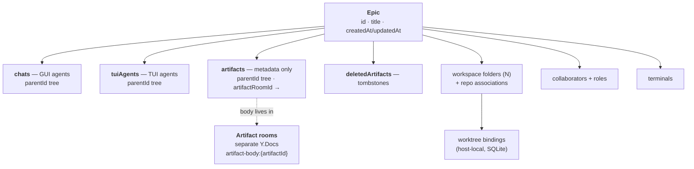
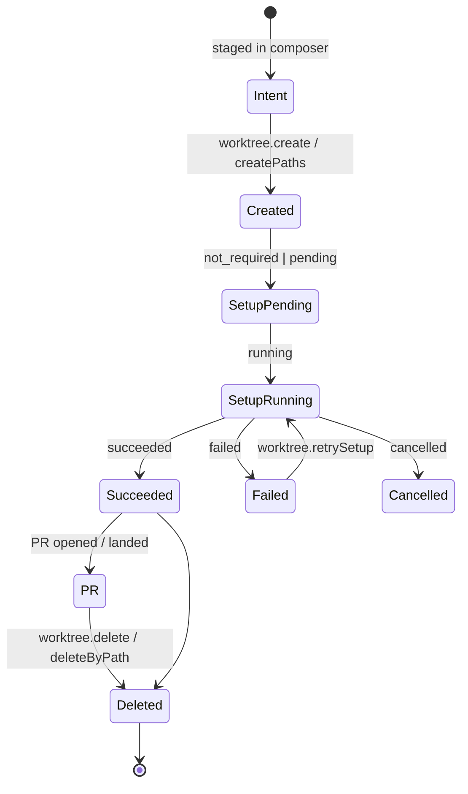

# Deep dive: the organization model

<user_quoted_section>Re-verified against ad605aa9 (2026-08-14). Original analysis ran against e372e303, 297 commits behind. Core model verified unchanged (Epic container, four artifact kinds, artifact rooms, parentId trees, host-local worktree bindings, clone-not-migrate). Three significant changes: Epic Mode was removed from the product, Chat-sync v2 introduces a non-Yjs head+shard transcript store, and remote hosts became first-class. See §9.</user_quoted_section>

How Traycer structures work: Epics as containers, the artifact model, multi-folder workspaces, worktree lifecycle, and how all of it persists.

## 1. The Epic

An **Epic** is the unit of organization: one durable container holding agents, terminals, artifacts, and workspace folders, plus its collaborator set. There are two modes — _regular_ for quick one-off tasks, _Epic mode_ for structured multi-step work.



The persisted record (`protocol/src/persistence/_internal/epic-schemas.ts`, schema **V200**):

```ts
{
  id, title, isTitleEditedByUser, createdAt, updatedAt,
  chats:            Record<string, Chat>,
  artifacts:        Record<string, EpicArtifact>,
  deletedArtifacts: Record<string, DeletedEpicArtifact>,
  tuiAgents:        Record<string, TuiAgent>,   // default {}
}
```

This is the _materialized_ shape — the plain-JSON equivalent the versioning framework diffs. On disk it's Yjs: `Y.XmlFragment` for artifact bodies, `Y.Array` for chat messages/events, `Y.Map` for the keyed collections.

Note V200 collapsed what V100 stored as four parallel maps (specs/tickets/stories/reviews) into one `artifacts` map with a `kind` discriminator, and converted legacy "executions" into tickets with nested spec/review children. A migration chain terminates at V200. Consolidating four near-identical collections into one discriminated map was the right cleanup.

## 2. The artifact model

Four kinds sharing a base:

```ts
{
  (id, folderName, title, artifactRoomId, createdAt, updatedAt, createdManually, parentId);
}
```

| Kind     | Extra fields         | Purpose                                                     |
| -------- | -------------------- | ----------------------------------------------------------- |
| `spec`   | —                    | Durable context: decision logs, walkthroughs, planning docs |
| `ticket` | `assignee`, `status` | Implementation work                                         |
| `story`  | `assignee`, `status` | Groups related artifacts, nothing more                      |
| `review` | —                    | Review comments / critique                                  |

`status` is an integer from a **separately versioned** `ticket-status` record in the common registry, so the status vocabulary evolves independently of the artifact shape. Good seam.

On disk an artifact is a **named directory containing `index.md`**; nesting directories nests artifacts. Frontmatter carries `kind`, `title`, and (for ticket/story) `status`. The renderer edits them in a TipTap editor bound to the Yjs fragment.

Deletion is a **tombstone**: the entry moves to `deletedArtifacts` with `{id, title, artifactRoomId, deletedAt}`, keeping the room reference so the body remains recoverable.

### Artifact rooms — the important architectural move

Bodies do **not** live in the Epic root doc. Each artifact's body is a root `Y.XmlFragment` under the deterministic key `artifact-body:{artifactId}` inside a separate per-room Y.Doc, referenced by `artifactRoomId`. Derivation is centralized:

```ts
export const ARTIFACT_BODY_FRAGMENT_PREFIX = "artifact-body:";
export function artifactBodyFragmentName(id: string) {
  return `${PREFIX}${id}`;
}
```

with an explicit instruction that _"every consumer that resolves an artifact body must derive the fragment name from this helper rather than hard-coding the prefix."_

`epic.subscribe` multiplexes both scopes over one subscription: root-scoped frames carry no `artifactRoomId` (root is implicit), room-scoped frames must carry one. Room frames include `hostArtifactRoomStateVectorBase64` so the client can advance per-room coverage without waiting for a full snapshot, and an `artifactRoomState` frame (`unavailable`/`retrying`/`ready`) drives per-artifact availability UI.

**Why this matters for us:** they clearly hit a scaling wall with everything in one doc and split artifact bodies out. The lesson they did _not_ apply is that **chat messages were left behind in the root doc** — see the [performance deep dive](../performance/index.md). Splitting bodies into rooms is the correct pattern; it should have been applied to messages too.

An `earlyMeta` frame is emitted **before** Tiptap/cloud sync completes so the renderer can paint workspace-derived UI (git status, file tree, repo chip, permissions) without waiting for the snapshot — and it deliberately omits fields that are only knowable after the room opens, rather than sending placeholders. Careful loading-state design.

## 3. Comment threads

Anchored comments on artifact text, with an unusually honest anchor model. `comments.listThreads` returns per thread:

```ts
{ thread, anchorStatus: "present"|"missing"|"unavailable",
  anchorOrder: number|null, anchorWarning: string|null }
```

`present` = the quoted text is still located in the current artifact. `missing`/`unavailable` = the quote is **context only** and must be verified before acting on it. Rather than silently re-anchoring or dropping the thread when text moves, they surface the uncertainty and tell consumers (including agents, via `traycer_list_comment_threads`) to treat it as unreliable.

Comment payloads ride the Y.Doc `update` channel — there is deliberately **no** typed `commentThread` frame, and the contract notes adding one later would be a breaking change requiring a new major. That's a documented, accepted constraint rather than an accident.

## 4. Multi-folder workspaces

An Epic binds **N workspace folders** simultaneously. The hard problem is that a cloud-synced Epic must resolve to different on-disk paths on each collaborator's machine. Three pieces solve it:

- **`repoIdentifier`** — `{owner, repo}`, derived from the git remote. The portable identity.
- **`repoMapping`** — host-local `{repoIdentifier, workspacePath, lastSyncedAt}` entries carried in the snapshot metadata. The per-machine translation table.
- **`workspace.resolvePathsByRepoIdentifiers`** — the resolution RPC. Unresolvable repos come back in `unresolvedRepos` so the UI can prompt.

The snapshot's `workspaceFolders` carries `{workspacePath, hostId, repoIdentifier, lastSyncedAt}` — every folder knows which host it belongs to.

Agents inherit or override folders: GUI chats inherit the Epic's folders; TUI agents persist their own `workspaceFolders`. `agent.create`'s `workspace.entries[]` is intent-level — the caller supplies the runnable `path` plus the source `workspacePath`, and the host derives mode, `repoIdentifier`, and primacy (**first entry is the working directory**) when it persists the binding. Mirrors the CLI's `--cwd` / `--workspace-entry <src>=<run>`.

## 5. Worktree lifecycle

The most operationally complex subsystem. A **binding** attaches an agent (owner kind `chat` or `terminal-agent`) to a set of directory entries:

```ts
entry = { workspacePath, mode: "local"|"worktree",
          repoIdentifier, worktreePath, … }
```

**Per-entry mode is the source of truth** — one binding can mix a local folder and a worktree folder. A top-level `workspaceMode` (`inherit`|`folderless`) exists only to distinguish an explicit no-folder binding from an old/null empty binding that should inherit the Epic's folders. That's a real backward-compatibility distinction, handled without a migration.

### Lifecycle



Setup states: `not_required` · `pending` · `running` · `succeeded` · `failed` · `cancelled`, with `worktree.retrySetup` and per-repo setup scripts (`worktree.setRepoScripts`).

**Submodule ownership** is the sharpest detail. `worktreeOwnedSubmoduleSchema` records `{repoIdentifier, branch}` for each submodule the binding _created_ a branch for during setup — deliberately distinct from whatever live checkout state a later probe finds. It exists so the merge rollup can require **every** owned branch (superproject + each submodule) to have landed — a true AND. A detached or pinned submodule with no branch is _not owned_ and never recorded. Distinguishing "what I created" from "what I observe" is exactly the kind of thing that's obvious in hindsight and painful to retrofit.

RPC surface: `create`, `createPaths`, `import`, `delete`, `deleteByPath`, `retrySetup`, `setEntryMode`, `setRepoScripts`, `getBinding`, `listAllForHost`, `listBindingsForEpic`, `listByWorkspacePaths`, `listBranches`, plus `worktree.changed` / `worktree.delete` streams. Settings → Worktrees is a full manager (paginated, filtered, tiered enrichment, PR chips, bulk delete) — and, tellingly, one of only two `perf(...)` commits in the repo was _"manual-refresh worktree settings and batch enrichment RPCs"_.

**Privacy note:** binding state is host-local (SQLite) and explicitly never synced — _"cloud collaborators must not see another collaborator's local paths or setup status."_

## 6. Host binding — the load-bearing rule

From the root `CLAUDE.md`, two domain rules:

**`hostId` ≡ `deviceId`.** One identifier names both the physical machine and the host process on it. `hostId` is canonical in code and schemas; "device" is UI-only copy. No parallel field.

**Tabs are bound to a host for life.** Every chat tab and terminal tab carries a persisted `hostId`. The React tree projects it via `<TabHostProvider hostId>`; consumers read `useTabHostId()`, **never** `useReactiveActiveHostId()`. Cross-host continuation is **clone-not-migrate**:

- **Chat** — continuing on a different host clones the artifact (new id, copied history).
- **Terminal** — bound for life; a PTY cannot migrate. If the host is unreachable the tab is permanently dead until that host returns.

Reachability is checked **at tab-open time only**, never reactively. There is deliberately no "swap host" affordance.

The renderer addresses **two host scopes simultaneously**:

| Scope               | Accessor                                        | Used by                                                         |
| ------------------- | ----------------------------------------------- | --------------------------------------------------------------- |
| **Default host**    | `useReactiveActiveHostId()` / `useHostClient()` | Epic list, opening artifacts, notifications, host-status footer |
| **Tab-scoped host** | `useTabHostId()` from `<TabHostProvider>`       | Everything inside a chat or terminal tab                        |

With the standing instruction: _"When adding a query/mutation hook, decide explicitly which scope it serves. Don't write a hook that silently switches scopes based on render context."_

**This is the single best organizational decision in the codebase.** Immutable per-tab host binding + clone-not-migrate + open-time-only reachability eliminates an entire class of bugs (half-migrated tabs, reactive host thrash, PTYs that appear to move). Multi-machine agent fleets is our headline feature — we should adopt this rule wholesale.

A `LEGACY_HOST_ID = "legacy"` sentinel marks chats migrated from v1.0.0 task-chain persistence, with an `isLegacyHost()` guard so the renderer gates host-bound affordances (terminal tabs, worktree actions) rather than crashing.

## 7. Persistence: where everything actually lives

| Data                                                                         | Store                                                      | Sync                 | Notes                                                                                            |
| ---------------------------------------------------------------------------- | ---------------------------------------------------------- | -------------------- | ------------------------------------------------------------------------------------------------ |
| Epic metadata, artifact metadata, chat + TUI agent records, `parentId` trees | Root Epic **Y.Doc**                                        | Cloud (Tiptap rooms) | CRDT, cross-device                                                                               |
| Artifact **bodies**                                                          | Per-room **Y.Doc** (`artifact-body:{id}`)                  | Cloud                | Separate rooms                                                                                   |
| Chat **messages / content blocks**                                           | Flat `YKeyValue` collections in the root doc               | Cloud                | ⚠ GUI never reads these from the doc — `chat.subscribe` streams `Message[]`. See perf deep dive. |
| Comment threads                                                              | Root Y.Doc update channel                                  | Cloud                | No typed frame                                                                                   |
| Awareness (cursors, presence, `agentWorking`)                                | Yjs Awareness                                              | Cloud-merged         | One entry per host; union is the cross-host active-agent view                                    |
| Worktree bindings, setup state                                               | Host **SQLite**                                            | **Never**            | Host-local by design                                                                             |
| Provider credentials                                                         | Shared credentials file, WAL + lock                        | Never                | Adversarial fuzz tests exist                                                                     |
| Canvas layout, tabs, drafts, settings                                        | Renderer **Zustand + persist** (localStorage / idb-keyval) | Per-device           | Persist-lifecycle bridge providers                                                               |
| Turn checkpoints                                                             | Checkpoint manifests                                       | Cloud                | Powers rewind/revert                                                                             |
| Notifications                                                                | Host + merged renderer store                               | Partly               | `merged-notifications.ts`                                                                        |

`AGENT_WORKING_AWARENESS_FIELD = "agentWorking"` is worth noting: each host publishes the ids of its locally-working agents into awareness, and the cloud-merged awareness (one entry per host) gives every client the **cross-host union** — so the Active Agents panel shows working agents regardless of which machine runs them. Awareness is the right transport for this: ephemeral, presence-shaped, auto-cleaned on disconnect. Contrast with message _delivery_, which has no cross-host path at all.

## 8. Assessment

**Strong:**

- Artifact rooms — correct decomposition of a CRDT that would otherwise be monolithic.
- Clone-not-migrate host binding with two explicitly named scopes.
- `repoIdentifier` + per-host `repoMapping` for portable multi-machine workspace identity.
- Owned-vs-observed submodule branches.
- Anchor-status honesty in comments.
- Host-local data (worktree paths, setup state) explicitly excluded from sync.

**Weak:**

- **Chat messages left in the root doc** when artifact bodies were correctly moved out. The pattern was established and not applied to the largest collection.
- Two parallel agent maps (`chats`, `tuiAgents`) with two `parentId` graphs, unified only at the RPC layer.
- Tombstones (`deletedArtifacts`) plus Yjs's own tombstones mean the doc grows monotonically with no documented compaction.
- Worktree lifecycle is genuinely complex and mostly surfaced through a 3,633-line settings panel.

**For our app:** adopt the Epic container, the artifact kinds + `parentId` tree, artifact rooms, the host-binding rules, and the repo-identifier indirection. Change: **one agent collection**, **transcripts out of the CRDT from day one** (see §9 — Traycer's own Chat-sync v2 is a better answer than my original "per-chat rooms" suggestion), and a documented compaction story.

## 9. Delta at `ad605aa9` (2026-08-14)

### Epic Mode was removed

`feat(gui-app,protocol,cli): remove Epic Mode (#749)`, with `feat(protocol): default agent mode to regular instead of epic (#628)` preceding it. `agentModeSchema = z.enum(["regular","epic"])` still exists in the protocol (reserved for compatibility with persisted records), but Epic Mode is gone as a user-facing surface.

This is a notable product signal: the "regular vs structured multi-step" mode split I documented in §1 was **tried and withdrawn**. Worth weighing before we build a two-mode product — Traycer shipped it, lived with it, and cut it. The Epic _container_ remains; only the mode distinction went away.

### Chat-sync v2 — transcripts leave the CRDT

`Chat-sync v2: host-authoritative chats with cloud backup, unified sidebar, identity pool, and clone-carries-history (#951)`, plus `multi-host chat records — delta stream, retraction UX, richer rows (#1134)` and `chat-sync persistence schema 1.1 — CDC cut plan and cohort membership (#1164)`.

New records `chat-head` and `chat-shard` (`protocol/src/persistence/chat-sync/`):

<user_quoted_section>"A published chat is a small mutable head plus a set of immutable, content-addressed shards. Unlike epic, neither lives in a Yjs doc… shards hold the transcript, so an append rewrites one cohort rather than the whole chat."</user_quoted_section>

Partitioned by evolution speed: the head's `core` _"evolves at reader speed"_ (what cloud renderers and clone targets interpret); `hostPrivate` is opaque to the protocol and _"evolves at host speed"_. Both records use **residual bags** so unmodeled keys survive an older reader's re-publication, and both carry a self-identifying `schemaVersion` pinned to a literal.

The epic Y.Doc **still** carries `chats` — this is a cutover in progress (hence "CDC cut plan"), not a completed migration. But the direction is unambiguous and correct: **the transcript is append-heavy immutable data and does not belong in a CRDT.** I'd now recommend this shape over my original "per-chat CRDT room" suggestion.

Related: `epic.setCloudChatVisibility` and chat sharing (#1151) — chats are now individually shareable with owner-side visibility controls; `epic.setChatArchived` plus archived indicators/filters (#1060, #897) make archival a first-class chat state.

### Remote hosts became first-class

`feat(remote-host): E2E remote-host transport, mux codec, and client UI (#188)` and `remote-host parity — switching, repo resolution, config/diagnostics, lifecycle, overview (#1133)`. A Noise-encrypted multiplexed relay transport (`clients/shared/host-transport/remote/`), remote folder browsing (`workspace.browseFolders`, #1054), and `feat(clients): host liveness via hosts DTO — retire the presence heartbeat (#1154)`.

The **clone-not-migrate** host-binding rule survives this intact — which is a meaningful validation. Adding remote hosts is exactly the change that would have broken a reactive host-switching model; because tabs bind a `hostId` for life, remote hosts slotted in as just more host ids. **This strengthens my original recommendation to adopt the rule wholesale.**

### New epic-scoped concepts

- **`roleClaims`** in the epic record — agent self-designated roles (see the [A2A deep dive §15](../agent-to-agent/index.md)).
- **Communication graph** — a per-epic A2A event log with playback (#809).
- **Usage analytics** — `host.usage.summary` (#1102) with an ECharts usage dashboard, by-model grouping (#1168) and a by-chat table (#1115).
- **MCP / plugins / skills settings** (#284) — capability-driven contracts and a real settings surface; skills are no longer only a `skills-lock.json` + composer picker.
- **Provider CLI version management** (#1103) — users pick, keep and pause provider CLI versions; plus a Model Providers wire contract and settings tab (#1058) and a provider-pack registry (#611).
- **Devices & Sessions surface with step-up OTP** (#757).
- **Chrome-style split tab view** (#594, #789) and drag-active-agents-into-tiles (#767).
- **PR view** (#423) after a revert-and-restore cycle (#754, #870).
- Harnesses grew 17 → **19** (`omp` / Oh My Pi #675, `huggingface` #1011).

### Verified unchanged

Four artifact kinds with `parentId` trees; artifact rooms and `artifactBodyFragmentName`; tombstoned `deletedArtifacts`; `earlyMeta` before full snapshot; comment `anchorStatus` honesty; per-entry worktree `mode`; owned-vs-observed submodule branches; host-local SQLite binding state excluded from sync; `hostId` canonical with clone-not-migrate; `LEGACY_HOST_ID`. Worktrees gained a per-repo branch-prefix override (#1067) and History-driven sweeps (#727, #739).
