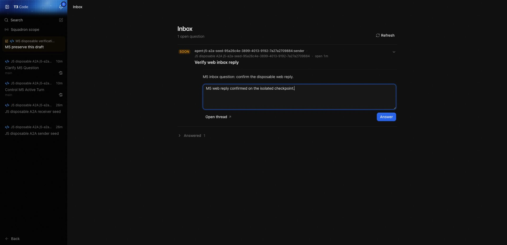
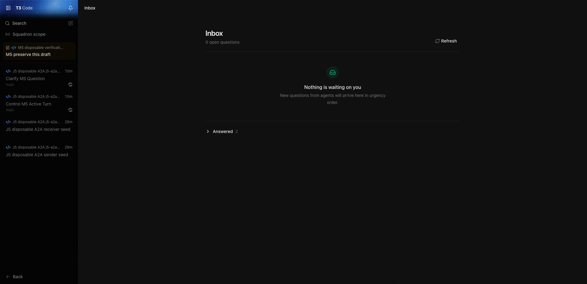
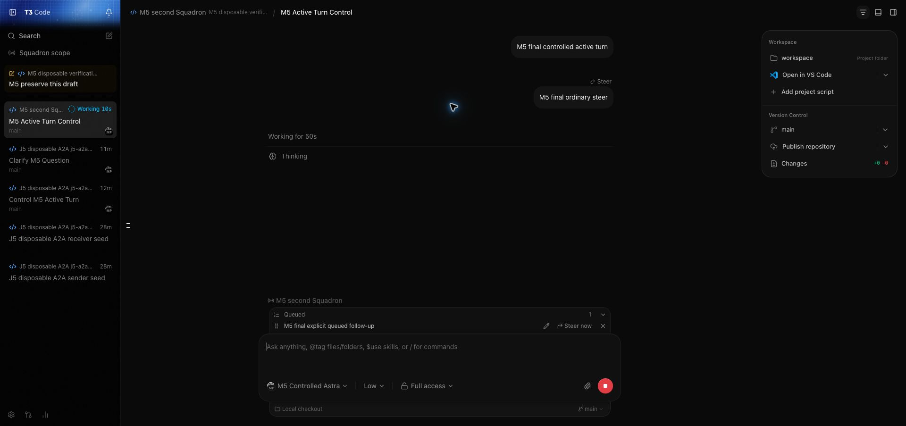

# Reviewed upstream integration evidence

Posted by an AI agent on Jackson's behalf

Candidate: `7f5a11afbd91e17f177accd8f2f20bbe6cb035f9`. Selected upstream: `b9fa1399cfbacf23f35ba9201af8aebe3f41e807`. Original fork: `51ee0fd64a2597d6ac4204b2096f164da240dbb3`.

The genuine two-parent merge preserves both histories and matches reviewed source tree `809ec1e85259b8bde757cccf4dace9c6f7e1cd4f`. [Checkpoint proof](checkpoint.json). All application runtime files equal accepted `08072116b129360b58ad794c7e11f690bfc6a543`; delivery preparation adds deferred documentation, a verified developer harness and a CI condition correction. [Audit summary](audit-summary.json), [451 original fork paths](fork-path-audit.json), [462 upstream-relative paths](upstream-relative-audit.json).

## Verification and limits

Focused migration, provider, messaging, lifecycle, client and identity tests passed at their recorded integration gates. Disposable real-snapshot startup preserves J5 tables and native references and remains unchanged on a second startup. The migration manifest recognizes the reviewed old-pin mapping; [manifest result](migration-manifest-check.json) is not a substitute for the separate database-upgrade proof. The restored no-provider harness reconciles 90 persisted events with 90 returned receipts. All four carried CI workflows passed actionlint; [workflow guard validation](workflow-validation.json).

M5 interactive verification used the real web/server/Codex adapter with a controlled local provider fixture. Jackson later tested real providers and reported the remaining manual tests passed. The later MCP-only fix passed nine focused tests: an accelerated installed-Codex transport fixture changed from 46/901 failures to 0/901; that is a controlled reproduction, not a live failure-rate estimate. One observed live peer reply was durably accepted once and delivered once. Native provider references were preserved.

The screenshots below were captured at `a3b261cb640337ef26ab1346511bcfc2a2e2f975`. Their web source is byte-identical to this candidate. Subsequent changes before the accepted runtime checkpoint affected only server MCP connections. Images show states; interaction receipts and persisted-state comparisons established behavior. The before/after pair is **before and after answering an inbox question**, not an old-code/new-code visual comparison.

| Before answering | After answering |
| --- | --- |
|  |  |

Desktop/mobile interaction, packaged-app execution, second-machine/relay/tunnel behavior and UI timing/performance were not verified. The user explicitly limited M5 interaction to web. The known upstream queued-message display-order issue was accepted without a local fix. CI/build results are pending publication and must be joined to the exact candidate SHA.

During initial M5 setup, the restored dev runner and not-yet-restored server disagreed on the home variable; two launches reached `~/.t3/dev`, where logs showed fresh migrations and no recovered/requeued runs. Pairing created one session there. The live userdata database was not opened by those launches; owned servers were stopped and no shared-state cleanup was attempted. Restoring the J5 home reader and adding a real runner/config boundary regression corrected it; all subsequent verification used isolated state.

Private databases, credentials and server logs are excluded. SHA256SUMS binds every published file in this packet. Model: GPT-6. Harness: Codex.
